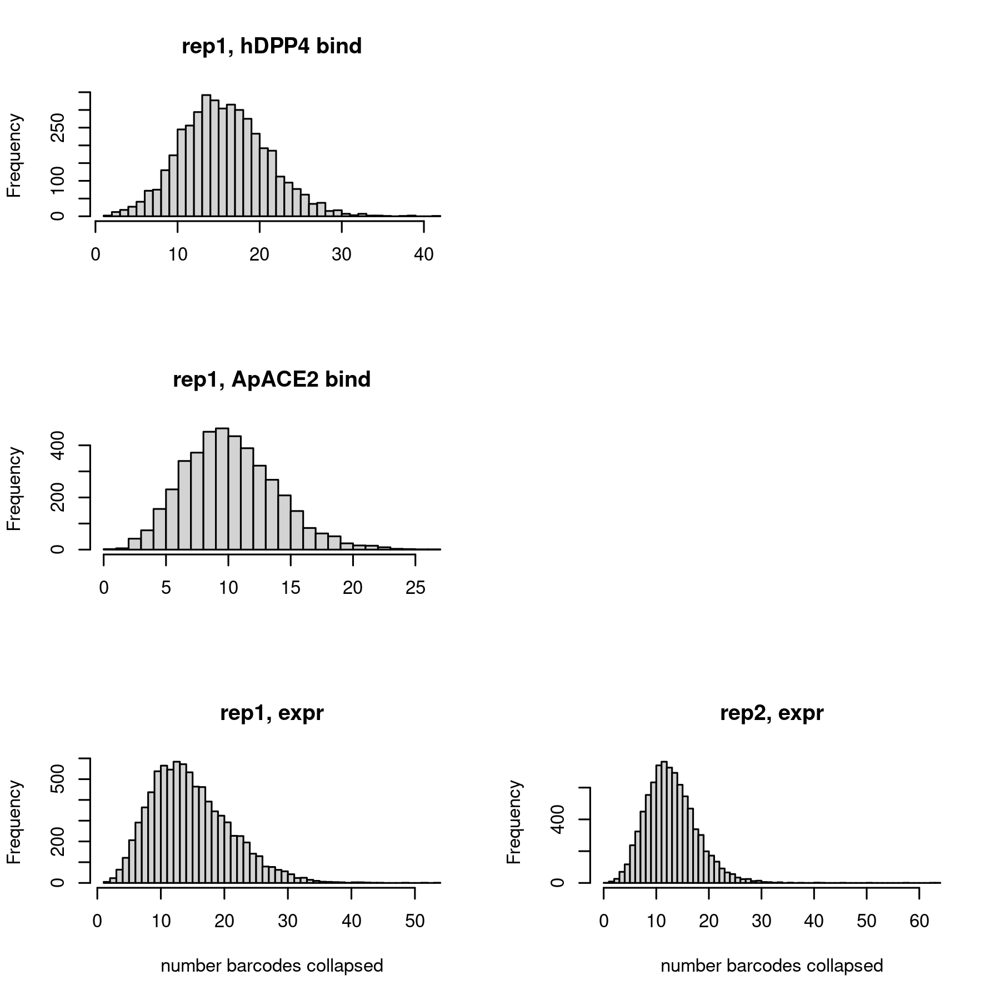
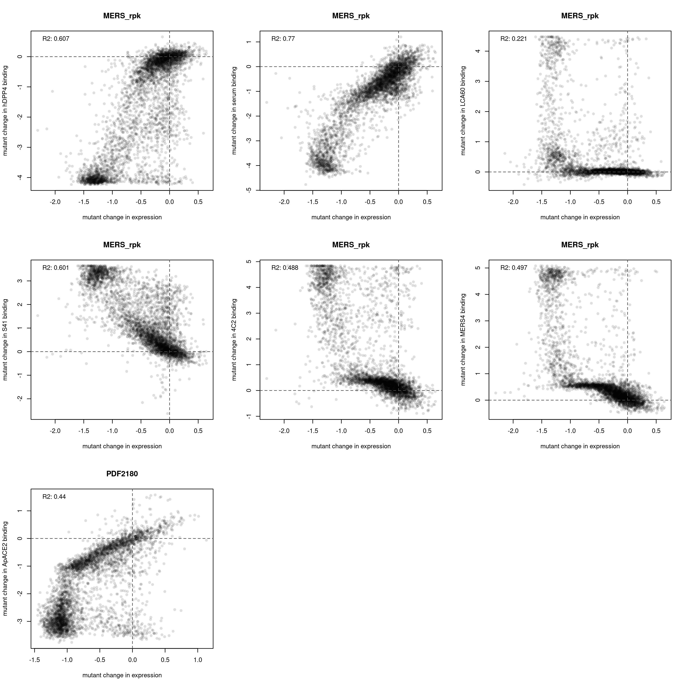

Collapse barcodes to final per-RBD/mutant phenotype scores
================
Tyler Starr
04/26/2024

- <a href="#setup" id="toc-setup">Setup</a>
- <a href="#calculate-per-variant-mean-scores-within-replicates"
  id="toc-calculate-per-variant-mean-scores-within-replicates">Calculate
  per-variant mean scores within replicates</a>
- <a href="#processorganize-and-expression-normalize-dms-data"
  id="toc-processorganize-and-expression-normalize-dms-data">Process/organize
  and expression-normalize DMS data</a>
- <a href="#calculate-per-mutant-score-across-dms-libraries"
  id="toc-calculate-per-mutant-score-across-dms-libraries">Calculate
  per-mutant score across DMS libraries</a>
- <a href="#heatmaps-for-mers_rpk" id="toc-heatmaps-for-mers_rpk">Heatmaps
  for MERS_rpk</a>
- <a href="#heatmaps-for-pdf2180" id="toc-heatmaps-for-pdf2180">Heatmaps
  for PDF2180</a>
- <a href="#processorganize-and-expression-normalize-pan-merbeco-data"
  id="toc-processorganize-and-expression-normalize-pan-merbeco-data">Process/organize
  and expression-normalize pan-merbeco data</a>
- <a href="#calculate-score-across-replicates"
  id="toc-calculate-score-across-replicates">Calculate score across
  replicates</a>
- <a href="#heatmaps-for-panmerbeco"
  id="toc-heatmaps-for-panmerbeco">Heatmaps for panmerbeco!</a>
  - <a href="#same-plots-for-rpk-variants-only"
    id="toc-same-plots-for-rpk-variants-only">same plots, for rpk variants
    only</a>

This notebook reads in the per-barcode titration Kds, expression, and
serum or mAb binding values from relevant scripts. It synthesizes these
two sets of results and calculates the final ‘mean’ phenotypes for each
variant, and generates some coverage and QC analyses.

``` r
#list of packages to install/load
packages = c("yaml","data.table","tidyverse","gridExtra","plotly","withr","htmlwidgets","knitr")
#install any packages not already installed
installed_packages <- packages %in% rownames(installed.packages())
if(any(installed_packages == F)){
  install.packages(packages[!installed_packages],
                   lib=c(paste("/uufs/chpc.utah.edu/common/home/",Sys.getenv("USER"),"/RLibs/",Sys.getenv("R_VERSION"),sep="")),
                   repos=c("http://cran.us.r-project.org"))
}
#load packages
invisible(lapply(packages, library, character.only=T))

knitr::opts_chunk$set(echo = T)
knitr::opts_chunk$set(dev.args = list(png = list(type = "cairo")))

#read in config file
config <- read_yaml("config.yaml")

#annotation on RBD sites
RBD_sites <- read.csv(file=config$RBD_sites,stringsAsFactors = F,header=T)

#make output directory
if(!file.exists(config$final_variant_scores_dir)){
  dir.create(file.path(config$final_variant_scores_dir))
}
```

Session info for reproducing environment:

``` r
sessionInfo()
```

    ## R version 4.1.3 (2022-03-10)
    ## Platform: x86_64-pc-linux-gnu (64-bit)
    ## Running under: Rocky Linux 8.8 (Green Obsidian)
    ## 
    ## Matrix products: default
    ## BLAS/LAPACK: /uufs/chpc.utah.edu/sys/spack/linux-rocky8-nehalem/gcc-8.5.0/intel-oneapi-mkl-2021.4.0-h43nkmwzvaltaa6ii5l7n6e7ruvjbmnv/mkl/2021.4.0/lib/intel64/libmkl_rt.so.1
    ## 
    ## locale:
    ##  [1] LC_CTYPE=en_US.UTF-8       LC_NUMERIC=C              
    ##  [3] LC_TIME=en_US.UTF-8        LC_COLLATE=en_US.UTF-8    
    ##  [5] LC_MONETARY=en_US.UTF-8    LC_MESSAGES=en_US.UTF-8   
    ##  [7] LC_PAPER=en_US.UTF-8       LC_NAME=C                 
    ##  [9] LC_ADDRESS=C               LC_TELEPHONE=C            
    ## [11] LC_MEASUREMENT=en_US.UTF-8 LC_IDENTIFICATION=C       
    ## 
    ## attached base packages:
    ## [1] stats     graphics  grDevices utils     datasets  methods   base     
    ## 
    ## other attached packages:
    ##  [1] knitr_1.37        htmlwidgets_1.5.4 withr_2.5.0       plotly_4.10.1    
    ##  [5] gridExtra_2.3     forcats_0.5.1     stringr_1.4.0     dplyr_1.0.8      
    ##  [9] purrr_0.3.4       readr_2.1.2       tidyr_1.2.0       tibble_3.1.6     
    ## [13] ggplot2_3.4.1     tidyverse_1.3.1   data.table_1.14.2 yaml_2.3.5       
    ## 
    ## loaded via a namespace (and not attached):
    ##  [1] tidyselect_1.1.2  xfun_0.30         haven_2.4.3       colorspace_2.0-3 
    ##  [5] vctrs_0.5.2       generics_0.1.2    viridisLite_0.4.0 htmltools_0.5.2  
    ##  [9] utf8_1.2.2        rlang_1.0.6       pillar_1.7.0      glue_1.6.2       
    ## [13] DBI_1.1.2         dbplyr_2.1.1      modelr_0.1.8      readxl_1.3.1     
    ## [17] lifecycle_1.0.3   munsell_0.5.0     gtable_0.3.0      cellranger_1.1.0 
    ## [21] rvest_1.0.2       evaluate_0.15     tzdb_0.2.0        fastmap_1.1.0    
    ## [25] fansi_1.0.2       broom_0.7.12      Rcpp_1.0.11       backports_1.4.1  
    ## [29] scales_1.2.1      jsonlite_1.8.7    fs_1.5.2          hms_1.1.1        
    ## [33] digest_0.6.29     stringi_1.7.6     grid_4.1.3        cli_3.6.0        
    ## [37] tools_4.1.3       magrittr_2.0.2    lazyeval_0.2.2    crayon_1.5.0     
    ## [41] pkgconfig_2.0.3   ellipsis_0.3.2    xml2_1.3.3        reprex_2.0.1     
    ## [45] lubridate_1.8.0   rstudioapi_0.13   assertthat_0.2.1  rmarkdown_2.13   
    ## [49] httr_1.4.7        R6_2.5.1          compiler_4.1.3

## Setup

Read in tables of per-barcode expression and binding Kd measurements and
combine.

``` r
dt_hDPP4 <- data.table(read.csv(config$Titeseq_Kds_file_hDPP4),stringsAsFactors=F)
dt_ApACE2 <- data.table(read.csv(config$Titeseq_Kds_file_ApACE2),stringsAsFactors=F)
dt_serum <- data.table(read.csv(config$sera_delta_AUC_file),stringsAsFactors=F)
dt_mAbs <- data.table(read.csv(config$mAb_EC50_file),stringsAsFactors=F)
dt_expr <- data.table(read.csv(config$expression_sortseq_file),stringsAsFactors=F)
```

## Calculate per-variant mean scores within replicates

Calculate the mean binding and expression score collapsed by genotype –
simple mean for log10Ka_receptor, log(expr) and serum AUC values, need
to do mean(log10(EC50))for mAbs. Also output the number of barcodes
across which a variant score was determined in each library.

``` r
#censor the associated "count" value for NA values since we average these averages among means contributing to final phenotype
dt_hDPP4[is.na(log10Ka_hDPP4),TiteSeq_hDPP4_avgcount:=NA]
dt_ApACE2[is.na(log10Ka_ApACE2),TiteSeq_ApACE2_avgcount:=NA]
dt_serum[is.na(serum_AUC),serum_avgcount:=NA]
dt_mAbs[is.na(EC50_LCA60),LCA60_avgcount:=NA]
dt_mAbs[is.na(EC50_S41),S41_avgcount:=NA]
dt_mAbs[is.na(EC50_4C2),X4C2_avgcount:=NA]
dt_mAbs[is.na(EC50_MERS4),MERS4_avgcount:=NA]
dt_expr[is.na(expression),expr_count:=NA]

#mean, sd, n_bc, and avg_count for collapsed values within each per-lib/sublib division
#hDPP4
dt_hDPP4[,mean_bind_hDPP4:=mean(log10Ka_hDPP4,na.rm=T),by=c("library","sublibrary","target","variant_class","aa_substitutions")]
dt_hDPP4[,sd_bind_hDPP4:=sd(log10Ka_hDPP4,na.rm=T),by=c("library","sublibrary","target","variant_class","aa_substitutions")]
dt_hDPP4[,n_bc_bind_hDPP4:=sum(!is.na(log10Ka_hDPP4)),by=c("library","sublibrary","target","variant_class","aa_substitutions")]
dt_hDPP4[,avg_count_bind_hDPP4:=mean(TiteSeq_hDPP4_avgcount,na.rm=T),by=c("library","sublibrary","target","variant_class","aa_substitutions")]

dt_hDPP4 <- unique(dt_hDPP4[,.(library,sublibrary,target,variant_class,aa_substitutions,n_aa_substitutions,mean_bind_hDPP4,sd_bind_hDPP4,n_bc_bind_hDPP4,avg_count_bind_hDPP4)])

#ApACE2
dt_ApACE2[,mean_bind_ApACE2:=mean(log10Ka_ApACE2,na.rm=T),by=c("library","sublibrary","target","variant_class","aa_substitutions")]
dt_ApACE2[,sd_bind_ApACE2:=sd(log10Ka_ApACE2,na.rm=T),by=c("library","sublibrary","target","variant_class","aa_substitutions")]
dt_ApACE2[,n_bc_bind_ApACE2:=sum(!is.na(log10Ka_ApACE2)),by=c("library","sublibrary","target","variant_class","aa_substitutions")]
dt_ApACE2[,avg_count_bind_ApACE2:=mean(TiteSeq_ApACE2_avgcount,na.rm=T),by=c("library","sublibrary","target","variant_class","aa_substitutions")]

dt_ApACE2 <- unique(dt_ApACE2[,.(library,sublibrary,target,variant_class,aa_substitutions,n_aa_substitutions,mean_bind_ApACE2,sd_bind_ApACE2,n_bc_bind_ApACE2,avg_count_bind_ApACE2)])

#sera
dt_serum[,mean_bind_serum:=mean(serum_AUC,na.rm=T),by=c("library","sublibrary","target","variant_class","aa_substitutions")]
dt_serum[,sd_bind_serum:=sd(serum_AUC,na.rm=T),by=c("library","sublibrary","target","variant_class","aa_substitutions")]
dt_serum[,n_bc_bind_serum:=sum(!is.na(serum_AUC)),by=c("library","sublibrary","target","variant_class","aa_substitutions")]
dt_serum[,avg_count_bind_serum:=mean(serum_avgcount,na.rm=T),by=c("library","sublibrary","target","variant_class","aa_substitutions")]

dt_serum <- unique(dt_serum[,.(library,sublibrary,target,variant_class,aa_substitutions,n_aa_substitutions,mean_bind_serum,sd_bind_serum,n_bc_bind_serum,avg_count_bind_serum)])

#mAbs
#LCA60
dt_mAbs[,mean_bind_LCA60:=mean(log10(EC50_LCA60),na.rm=T),by=c("library","sublibrary","target","variant_class","aa_substitutions")]
dt_mAbs[,sd_bind_LCA60:=sd(log10(EC50_LCA60),na.rm=T),by=c("library","sublibrary","target","variant_class","aa_substitutions")]
dt_mAbs[,n_bc_bind_LCA60:=sum(!is.na(EC50_LCA60)),by=c("library","sublibrary","target","variant_class","aa_substitutions")]
dt_mAbs[,avg_count_bind_LCA60:=mean(LCA60_avgcount,na.rm=T),by=c("library","sublibrary","target","variant_class","aa_substitutions")]

#S41
dt_mAbs[,mean_bind_S41:=mean(log10(EC50_S41),na.rm=T),by=c("library","sublibrary","target","variant_class","aa_substitutions")]
dt_mAbs[,sd_bind_S41:=sd(log10(EC50_S41),na.rm=T),by=c("library","sublibrary","target","variant_class","aa_substitutions")]
dt_mAbs[,n_bc_bind_S41:=sum(!is.na(EC50_S41)),by=c("library","sublibrary","target","variant_class","aa_substitutions")]
dt_mAbs[,avg_count_bind_S41:=mean(S41_avgcount,na.rm=T),by=c("library","sublibrary","target","variant_class","aa_substitutions")]

#4C2
dt_mAbs[,mean_bind_4C2:=mean(log10(EC50_4C2),na.rm=T),by=c("library","sublibrary","target","variant_class","aa_substitutions")]
dt_mAbs[,sd_bind_4C2:=sd(log10(EC50_4C2),na.rm=T),by=c("library","sublibrary","target","variant_class","aa_substitutions")]
dt_mAbs[,n_bc_bind_4C2:=sum(!is.na(EC50_4C2)),by=c("library","sublibrary","target","variant_class","aa_substitutions")]
dt_mAbs[,avg_count_bind_4C2:=mean(X4C2_avgcount,na.rm=T),by=c("library","sublibrary","target","variant_class","aa_substitutions")]

#MERS4
dt_mAbs[,mean_bind_MERS4:=mean(log10(EC50_MERS4),na.rm=T),by=c("library","sublibrary","target","variant_class","aa_substitutions")]
dt_mAbs[,sd_bind_MERS4:=sd(log10(EC50_MERS4),na.rm=T),by=c("library","sublibrary","target","variant_class","aa_substitutions")]
dt_mAbs[,n_bc_bind_MERS4:=sum(!is.na(EC50_MERS4)),by=c("library","sublibrary","target","variant_class","aa_substitutions")]
dt_mAbs[,avg_count_bind_MERS4:=mean(MERS4_avgcount,na.rm=T),by=c("library","sublibrary","target","variant_class","aa_substitutions")]

dt_mAbs <- unique(dt_mAbs[,.(library,sublibrary,target,variant_class,aa_substitutions,n_aa_substitutions,
                             mean_bind_LCA60,sd_bind_LCA60,n_bc_bind_LCA60,avg_count_bind_LCA60,
                             mean_bind_S41,sd_bind_S41,n_bc_bind_S41,avg_count_bind_S41,
                             mean_bind_4C2,sd_bind_4C2,n_bc_bind_4C2,avg_count_bind_4C2,
                             mean_bind_MERS4,sd_bind_MERS4,n_bc_bind_MERS4,avg_count_bind_MERS4)])

#expr
dt_expr[,mean_expr:=mean(expression,na.rm=T),by=c("library","sublibrary","target","variant_class","aa_substitutions")]
dt_expr[,sd_expr:=sd(expression,na.rm=T),by=c("library","sublibrary","target","variant_class","aa_substitutions")]
dt_expr[,n_bc_expr:=sum(!is.na(expression)),by=c("library","sublibrary","target","variant_class","aa_substitutions")]
dt_expr[,avg_count_expr:=mean(expr_count,na.rm=T),by=c("library","sublibrary","target","variant_class","aa_substitutions")]

dt_expr <- unique(dt_expr[,.(library,sublibrary,target,variant_class,aa_substitutions,n_aa_substitutions,mean_expr,sd_expr,n_bc_expr,avg_count_expr)])
```

Some QC plots. First, for DMS libs, look at distribution of number
barcodes for binding and expression measurements for single mutant
detemrinations. These are ‘left-justified’ histograms, so the leftmost
bar represents the number of genotypes for which no barcodes were
collapsed to final measurement in a pool.

Note, for many of these plots, I exclude A106P in MERS_rpk libs because
we saw from pacbio it has overrepresentation among variants and so
dominates the x-axis

``` r
par(mfrow=c(3,2))
#hDPP4
hist(dt_hDPP4[library=="pool1" & variant_class %in% c("1 nonsynonymous") & n_aa_substitutions==1 & aa_substitutions!="A106P",n_bc_bind_hDPP4],main="rep1, hDPP4 bind",right=F,breaks=max(dt_hDPP4[library=="pool1" & variant_class %in% c("1 nonsynonymous","deletion") & n_aa_substitutions==1 & n_aa_substitutions==1 & aa_substitutions!="A106P",n_bc_bind_hDPP4],na.rm=T),xlab="")
#hist(dt_hDPP4[library=="pool2" & variant_class %in% c("1 nonsynonymous","deletion") & n_aa_substitutions==1 & n_aa_substitutions==1 & aa_substitutions!="A106P",n_bc_bind_hDPP4],main="pool2, bind",right=F,breaks=max(dt_hDPP4[library=="pool2" & variant_class %in% c("1 nonsynonymous","deletion") & n_aa_substitutions==1 & n_aa_substitutions==1 & aa_substitutions!="A106P",n_bc_bind_hDPP4],na.rm=T),xlab="")
plot(0,type='n',axes=FALSE,ann=F)

#ApACE2
hist(dt_ApACE2[library=="pool3" & variant_class %in% c("1 nonsynonymous") & n_aa_substitutions==1,n_bc_bind_ApACE2],main="rep1, ApACE2 bind",right=F,breaks=max(dt_ApACE2[library=="pool3" & variant_class %in% c("1 nonsynonymous","deletion") & n_aa_substitutions==1,n_bc_bind_ApACE2],na.rm=T),xlab="")
#hist(dt_ApACE2[library=="pool2" & variant_class %in% c("1 nonsynonymous","deletion") & n_aa_substitutions==1,n_bc_bind_ApACE2],main="pool2, bind",right=F,breaks=max(dt_ApACE2[library=="pool2" & variant_class %in% c("1 nonsynonymous","deletion") & n_aa_substitutions==1,n_bc_bind_ApACE2],na.rm=T),xlab="")
plot(0,type='n',axes=FALSE,ann=F)


hist(dt_expr[library=="pool5" & variant_class %in% c("1 nonsynonymous","deletion") & n_aa_substitutions==1  & n_aa_substitutions==1 & aa_substitutions!="A106P",n_bc_expr],main="rep1, expr",right=F,breaks=max(dt_expr[library=="pool5" & variant_class %in% c("1 nonsynonymous","deletion") & n_aa_substitutions==1 & n_aa_substitutions==1 & aa_substitutions!="A106P",n_bc_expr],na.rm=T),xlab="number barcodes collapsed")
hist(dt_expr[library=="pool6" & variant_class %in% c("1 nonsynonymous","deletion") & n_aa_substitutions==1 & n_aa_substitutions==1 & aa_substitutions!="A106P",n_bc_expr],main="rep2, expr",right=F,breaks=max(dt_expr[library=="pool6" & variant_class %in% c("1 nonsynonymous","deletion") & n_aa_substitutions==1 & n_aa_substitutions==1 & aa_substitutions!="A106P",n_bc_expr],na.rm=T),xlab="number barcodes collapsed")
```



``` r
invisible(dev.print(pdf, paste(config$final_variant_scores_dir,"/histogram_n_bc_per_geno_sep-libs.pdf",sep=""),useDingbats=F))
```

What about how SEM tracks with number of barcodes collapsed? This could
help for choosing a minimum number of barcodes to use.

``` r
par(mfrow=c(3,2))
#hDPP4
plot(dt_hDPP4[library=="pool1" & variant_class %in% c("1 nonsynonymous") & n_aa_substitutions==1  & n_aa_substitutions==1 & aa_substitutions!="A106P",n_bc_bind_hDPP4],
     dt_hDPP4[library=="pool1" & variant_class %in% c("1 nonsynonymous") & n_aa_substitutions==1 & n_aa_substitutions==1 & aa_substitutions!="A106P",sd_bind_hDPP4/sqrt(n_bc_bind_hDPP4)],
     pch=16,col="#00000005",main="rep1, hDPP4 bind",ylab="SEM",xlab="number barcodes collapsed")
# plot(dt_hDPP4[library=="pool2" & variant_class %in% c("1 nonsynonymous","deletion") & n_aa_substitutions==1  & n_aa_substitutions==1 & aa_substitutions!="A106P",n_bc_bind],
#      dt_hDPP4[library=="pool2" & variant_class %in% c("1 nonsynonymous","deletion") & n_aa_substitutions==1  & n_aa_substitutions==1 & aa_substitutions!="A106P",sd_bind/sqrt(n_bc_bind)],
#      pch=16,col="#00000005",main="rep2, bind",ylab="SEM",xlab="number barcodes collapsed")
plot(0,type='n',axes=FALSE,ann=F)

#ApACE2
plot(dt_ApACE2[library=="pool3" & variant_class %in% c("1 nonsynonymous") & n_aa_substitutions==1,n_bc_bind_ApACE2],
     dt_ApACE2[library=="pool3" & variant_class %in% c("1 nonsynonymous") & n_aa_substitutions==1,sd_bind_ApACE2/sqrt(n_bc_bind_ApACE2)],
     pch=16,col="#00000005",main="rep1, ApACE2 bind",ylab="SEM",xlab="number barcodes collapsed")
# plot(dt_ApACE2[library=="pool4" & variant_class %in% c("1 nonsynonymous","deletion") & n_aa_substitutions==1,n_bc_bind],
#      dt_ApACE2[library=="pool4" & variant_class %in% c("1 nonsynonymous","deletion") & n_aa_substitutions==1,sd_bind/sqrt(n_bc_bind)],
#      pch=16,col="#00000005",main="rep2, bind",ylab="SEM",xlab="number barcodes collapsed")
plot(0,type='n',axes=FALSE,ann=F)

#expr
plot(dt_expr[library=="pool5" & variant_class %in% c("1 nonsynonymous","deletion") & n_aa_substitutions==1 & n_aa_substitutions==1 & aa_substitutions!="A106P",n_bc_expr],
     dt_expr[library=="pool5" & variant_class %in% c("1 nonsynonymous","deletion") & n_aa_substitutions==1 & n_aa_substitutions==1 & aa_substitutions!="A106P",sd_expr/sqrt(n_bc_expr)],
     pch=16,col="#00000005",main="pool5, expr",ylab="SEM",xlab="number barcodes collapsed")
plot(dt_expr[library=="pool6" & variant_class %in% c("1 nonsynonymous","deletion") & n_aa_substitutions==1 & n_aa_substitutions==1 & aa_substitutions!="A106P",n_bc_expr],
     dt_expr[library=="pool6" & variant_class %in% c("1 nonsynonymous","deletion") & n_aa_substitutions==1 & n_aa_substitutions==1 & aa_substitutions!="A106P",sd_expr/sqrt(n_bc_expr)],
     pch=16,col="#00000005",main="pool6, expr",ylab="SEM",xlab="number barcodes collapsed")
```


``` r
invisible(dev.print(pdf, paste(config$final_variant_scores_dir,"/sem_v_n-bc.pdf",sep=""),useDingbats=F))
```

Format/break up tables into (i) a ‘mutation lookup table’, where we
focus just on the single mutants (and wildtype) in the DMS libraries,
breakup the string of mutations, and fill in the table to also include
any missing mutants, and (ii) panmerbeco pool of wildtype values. We’ll
do each all the way through visualization below under major headings.

## Process/organize and expression-normalize DMS data

``` r
#hDPP4 MERS_rpk
dt_mutant_hDPP4 <- dt_hDPP4[sublibrary %in% c("lib84","lib85") & variant_class %in% c("1 nonsynonymous","deletion") & n_aa_substitutions==1,]

#split mutation string
#define function to apply
split_mut <- function(x){
  split <- strsplit(x,split="")[[1]]
  return(list(split[1],as.numeric(paste(split[2:(length(split)-1)],collapse="")),split[length(split)]))
}
dt_mutant_hDPP4[,c("wildtype","position","mutant"):=split_mut(as.character(aa_substitutions)),by=aa_substitutions]

dt_mutant_hDPP4 <- dt_mutant_hDPP4[,.(library,target,wildtype,position,mutant,mean_bind_hDPP4,sd_bind_hDPP4,n_bc_bind_hDPP4,avg_count_bind_hDPP4)]

aas <- c("A","C","D","E","F","G","H","I","K","L","M","N","P","Q","R","S","T","V","W","Y","-")
#fill out missing values in table with a hideous loop, so the table is complete for all mutaitons (including those that are missing). If you are somebody who is reading this code, I apologize.
# for(lib in c("pool1","pool2")){
for(lib in c("pool1")){
  for(bg in as.character(unique(dt_mutant_hDPP4$target))){
    for(pos in 1:max(dt_mutant_hDPP4$position)){
      for(aa in aas){
        if(!(aa %in% as.character(dt_mutant_hDPP4[library==lib & target==bg & position==pos,mutant]))){
          dt_mutant_hDPP4 <- rbind(dt_mutant_hDPP4,list(lib, bg, dt_mutant_hDPP4[target==bg & position==pos,wildtype][1],pos,aa),fill=T) #note this will leave NA for wildtype if a position is completely missing in both libraries
        }
      }
    }
  }
}
setkey(dt_mutant_hDPP4,library,target,position,mutant)

#fill in wildtype values -- should vectorize in data table but being so stupid so just going to write for loop
for(bg in c("MERS_rpk")){
  # for(lib in c("pool1","pool2")){
  for(lib in c("pool1")){
    dt_mutant_hDPP4[library==lib & target==bg & wildtype==mutant, c("mean_bind_hDPP4","sd_bind_hDPP4","n_bc_bind_hDPP4","avg_count_bind_hDPP4"):=dt_hDPP4[library==lib & target==bg & variant_class=="wildtype",.(mean_bind_hDPP4,sd_bind_hDPP4,n_bc_bind_hDPP4,avg_count_bind_hDPP4)]]
  }
}

#add delta bind measures
for(bg in c("MERS_rpk")){
  # for(lib in c("pool1","pool2")){
  for(lib in c("pool1")){  
    ref_bind <- dt_hDPP4[library==lib & target==bg & variant_class=="wildtype",mean_bind_hDPP4]
    dt_mutant_hDPP4[library==lib & target==bg,delta_bind_hDPP4 := mean_bind_hDPP4 - ref_bind]
  }
}


#ApACE2 PDF2180
dt_mutant_ApACE2 <- dt_ApACE2[sublibrary %in% c("lib53","lib54") & variant_class %in% c("1 nonsynonymous","deletion") & n_aa_substitutions==1,]

#split mutation string
#define function to apply
split_mut <- function(x){
  split <- strsplit(x,split="")[[1]]
  return(list(split[1],as.numeric(paste(split[2:(length(split)-1)],collapse="")),split[length(split)]))
}
dt_mutant_ApACE2[,c("wildtype","position","mutant"):=split_mut(as.character(aa_substitutions)),by=aa_substitutions]

dt_mutant_ApACE2 <- dt_mutant_ApACE2[,.(library,target,wildtype,position,mutant,mean_bind_ApACE2,sd_bind_ApACE2,n_bc_bind_ApACE2,avg_count_bind_ApACE2)]

aas <- c("A","C","D","E","F","G","H","I","K","L","M","N","P","Q","R","S","T","V","W","Y","-")
#fill out missing values in table with a hideous loop, so the table is complete for all mutaitons (including those that are missing). If you are somebody who is reading this code, I apologize.
# for(lib in c("pool3","pool4")){
for(lib in c("pool3")){
  for(bg in as.character(unique(dt_mutant_ApACE2$target))){
    for(pos in 1:max(dt_mutant_ApACE2$position)){
      for(aa in aas){
        if(!(aa %in% as.character(dt_mutant_ApACE2[library==lib & target==bg & position==pos,mutant]))){
          dt_mutant_ApACE2 <- rbind(dt_mutant_ApACE2,list(lib, bg, dt_mutant_ApACE2[target==bg & position==pos,wildtype][1],pos,aa),fill=T) #note this will leave NA for wildtype if a position is completely missing in both libraries
        }
      }
    }
  }
}
setkey(dt_mutant_ApACE2,library,target,position,mutant)

#fill in wildtype values -- should vectorize in data table but being so stupid so just going to write for loop
for(bg in c("PDF2180")){
  # for(lib in c("pool3","pool4")){
  for(lib in c("pool3")){
    dt_mutant_ApACE2[library==lib & target==bg & wildtype==mutant, c("mean_bind_ApACE2","sd_bind_ApACE2","n_bc_bind_ApACE2","avg_count_bind_ApACE2"):=dt_ApACE2[library==lib & target==bg & variant_class=="wildtype",.(mean_bind_ApACE2,sd_bind_ApACE2,n_bc_bind_ApACE2,avg_count_bind_ApACE2)]]
  }
}

#add delta bind measures
for(bg in c("PDF2180")){
  # for(lib in c("pool3","pool4")){
  for(lib in c("pool3")){  
    ref_bind <- dt_ApACE2[library==lib & target==bg & variant_class=="wildtype",mean_bind_ApACE2]
    dt_mutant_ApACE2[library==lib & target==bg,delta_bind_ApACE2 := mean_bind_ApACE2 - ref_bind]
  }
}


#serum MERS_rpk, two replicats
dt_mutant_serum <- dt_serum[sublibrary %in% c("lib84","lib85") & variant_class %in% c("1 nonsynonymous","deletion") & n_aa_substitutions==1,]

#split mutation string
#define function to apply
split_mut <- function(x){
  split <- strsplit(x,split="")[[1]]
  return(list(split[1],as.numeric(paste(split[2:(length(split)-1)],collapse="")),split[length(split)]))
}
dt_mutant_serum[,c("wildtype","position","mutant"):=split_mut(as.character(aa_substitutions)),by=aa_substitutions]

dt_mutant_serum <- dt_mutant_serum[,.(library,target,wildtype,position,mutant,mean_bind_serum,sd_bind_serum,n_bc_bind_serum,avg_count_bind_serum)]

aas <- c("A","C","D","E","F","G","H","I","K","L","M","N","P","Q","R","S","T","V","W","Y","-")
#fill out missing values in table with a hideous loop, so the table is complete for all mutaitons (including those that are missing). If you are somebody who is reading this code, I apologize.
for(lib in c("pool1","pool2")){
  for(bg in as.character(unique(dt_mutant_serum$target))){
    for(pos in 1:max(dt_mutant_serum$position)){
      for(aa in aas){
        if(!(aa %in% as.character(dt_mutant_serum[library==lib & target==bg & position==pos,mutant]))){
          dt_mutant_serum <- rbind(dt_mutant_serum,list(lib, bg, dt_mutant_serum[target==bg & position==pos,wildtype][1],pos,aa),fill=T) #note this will leave NA for wildtype if a position is completely missing in both libraries
        }
      }
    }
  }
}
setkey(dt_mutant_serum,library,target,position,mutant)

#fill in wildtype values -- should vectorize in data table but being so stupid so just going to write for loop
for(bg in c("MERS_rpk")){
  for(lib in c("pool1","pool2")){
    dt_mutant_serum[library==lib & target==bg & wildtype==mutant, 
                    c("mean_bind_serum","sd_bind_serum","n_bc_bind_serum","avg_count_bind_serum") := 
                      dt_serum[library==lib & target==bg & variant_class=="wildtype",
                               .(mean_bind_serum,sd_bind_serum,n_bc_bind_serum,avg_count_bind_serum)]]
  }
}

#add delta bind measures)
for(bg in c("MERS_rpk")){
  for(lib in c("pool1","pool2")){
    ref_bind <- dt_serum[library==lib & target==bg & variant_class=="wildtype",mean_bind_serum]
    dt_mutant_serum[library==lib & target==bg,delta_bind_serum := mean_bind_serum - ref_bind]
  }
}

#mAbs, MERS_rpk, 2 reps for one mAb one rep for others
dt_mutant_mAbs <- dt_mAbs[sublibrary %in% c("lib84","lib85") & variant_class %in% c("1 nonsynonymous","deletion") & n_aa_substitutions==1,]

#split mutation string
#define function to apply
split_mut <- function(x){
  split <- strsplit(x,split="")[[1]]
  return(list(split[1],as.numeric(paste(split[2:(length(split)-1)],collapse="")),split[length(split)]))
}
dt_mutant_mAbs[,c("wildtype","position","mutant"):=split_mut(as.character(aa_substitutions)),by=aa_substitutions]

dt_mutant_mAbs <- dt_mutant_mAbs[,.(library,target,wildtype,position,mutant,
                                    mean_bind_LCA60,sd_bind_LCA60,n_bc_bind_LCA60,avg_count_bind_LCA60,
                                    mean_bind_S41,sd_bind_S41,n_bc_bind_S41,avg_count_bind_S41,
                                    mean_bind_4C2,sd_bind_4C2,n_bc_bind_4C2,avg_count_bind_4C2,
                                    mean_bind_MERS4,sd_bind_MERS4,n_bc_bind_MERS4,avg_count_bind_MERS4)]

aas <- c("A","C","D","E","F","G","H","I","K","L","M","N","P","Q","R","S","T","V","W","Y","-")
#fill out missing values in table with a hideous loop, so the table is complete for all mutaitons (including those that are missing). If you are somebody who is reading this code, I apologize.
for(lib in c("pool1","pool2")){
  for(bg in as.character(unique(dt_mutant_mAbs$target))){
    for(pos in 1:max(dt_mutant_mAbs$position)){
      for(aa in aas){
        if(!(aa %in% as.character(dt_mutant_mAbs[library==lib & target==bg & position==pos,mutant]))){
          dt_mutant_mAbs <- rbind(dt_mutant_mAbs,list(lib, bg, dt_mutant_mAbs[target==bg & position==pos,wildtype][1],pos,aa),fill=T) #note this will leave NA for wildtype if a position is completely missing in both libraries
        }
      }
    }
  }
}
setkey(dt_mutant_mAbs,library,target,position,mutant)

#fill in wildtype values for each mAb -- should vectorize in data table but being so stupid so just going to write for loop
for(bg in c("MERS_rpk")){
  for(lib in c("pool1","pool2")){
    dt_mutant_mAbs[library==lib & target==bg & wildtype==mutant, 
                    c("mean_bind_LCA60","sd_bind_LCA60","n_bc_bind_LCA60","avg_count_bind_LCA60",
                      "mean_bind_S41","sd_bind_S41","n_bc_bind_S41","avg_count_bind_S41",
                      "mean_bind_4C2","sd_bind_4C2","n_bc_bind_4C2","avg_count_bind_4C2",
                      "mean_bind_MERS4","sd_bind_MERS4","n_bc_bind_MERS4","avg_count_bind_MERS4"
                      ) := 
                      dt_mAbs[library==lib & target==bg & variant_class=="wildtype",
                               .(mean_bind_LCA60,sd_bind_LCA60,n_bc_bind_LCA60,avg_count_bind_LCA60,
                                 mean_bind_S41,sd_bind_S41,n_bc_bind_S41,avg_count_bind_S41,
                                 mean_bind_4C2,sd_bind_4C2,n_bc_bind_4C2,avg_count_bind_4C2,
                                 mean_bind_MERS4,sd_bind_MERS4,n_bc_bind_MERS4,avg_count_bind_MERS4)]]
  }
}

#add delta bind measures
for(bg in c("MERS_rpk")){
  for(lib in c("pool1","pool2")){
    ref_bind_LCA60 <- dt_mAbs[library==lib & target==bg & variant_class=="wildtype",mean_bind_LCA60]
    ref_bind_S41 <- dt_mAbs[library==lib & target==bg & variant_class=="wildtype",mean_bind_S41]
    ref_bind_4C2 <- dt_mAbs[library==lib & target==bg & variant_class=="wildtype",mean_bind_4C2]
    ref_bind_MERS4 <- dt_mAbs[library==lib & target==bg & variant_class=="wildtype",mean_bind_MERS4]
    
    dt_mutant_mAbs[library==lib & target==bg,delta_bind_LCA60 := mean_bind_LCA60 - ref_bind_LCA60]
    dt_mutant_mAbs[library==lib & target==bg,delta_bind_S41 := mean_bind_S41 - ref_bind_S41]
    dt_mutant_mAbs[library==lib & target==bg,delta_bind_4C2 := mean_bind_4C2 - ref_bind_4C2]
    dt_mutant_mAbs[library==lib & target==bg,delta_bind_MERS4 := mean_bind_MERS4 - ref_bind_MERS4]
  }
}

#expr, 2 reps, both backgrounds
dt_mutant_expr_MERS_rpk <- dt_expr[sublibrary %in% c("lib84","lib85") & variant_class %in% c("1 nonsynonymous","deletion") & n_aa_substitutions==1,]
dt_mutant_expr_PDF2180 <- dt_expr[sublibrary %in% c("lib53","lib54") & variant_class %in% c("1 nonsynonymous","deletion") & n_aa_substitutions==1,]


#split mutation string
#define function to apply
split_mut <- function(x){
  split <- strsplit(x,split="")[[1]]
  return(list(split[1],as.numeric(paste(split[2:(length(split)-1)],collapse="")),split[length(split)]))
}
dt_mutant_expr_MERS_rpk[,c("wildtype","position","mutant"):=split_mut(as.character(aa_substitutions)),by=aa_substitutions]
dt_mutant_expr_PDF2180[,c("wildtype","position","mutant"):=split_mut(as.character(aa_substitutions)),by=aa_substitutions]

dt_mutant_expr_MERS_rpk <- dt_mutant_expr_MERS_rpk[,.(library,target,wildtype,position,mutant,mean_expr,sd_expr,n_bc_expr,avg_count_expr)]
dt_mutant_expr_PDF2180 <- dt_mutant_expr_PDF2180[,.(library,target,wildtype,position,mutant,mean_expr,sd_expr,n_bc_expr,avg_count_expr)]

aas <- c("A","C","D","E","F","G","H","I","K","L","M","N","P","Q","R","S","T","V","W","Y","-")
#fill out missing values in table with a hideous loop, so the table is complete for all mutaitons (including those that are missing). If you are somebody who is reading this code, I apologize.
#MERS_rpk
for(lib in c("pool5","pool6")){
  for(bg in as.character(unique(dt_mutant_expr_MERS_rpk$target))){
    for(pos in 1:max(dt_mutant_expr_MERS_rpk$position)){
      for(aa in aas){
        if(!(aa %in% as.character(dt_mutant_expr_MERS_rpk[library==lib & target==bg & position==pos,mutant]))){
          dt_mutant_expr_MERS_rpk <- rbind(dt_mutant_expr_MERS_rpk,list(lib, bg, dt_mutant_expr_MERS_rpk[target==bg & position==pos,wildtype][1],pos,aa),fill=T)  #note this will leave NA for wildtype if a position is completely missing in both libraries
        }
      }
    }
  }
}
setkey(dt_mutant_expr_MERS_rpk,library,target,position,mutant)

#PDF2180
for(lib in c("pool5","pool6")){
  for(bg in as.character(unique(dt_mutant_expr_PDF2180$target))){
    for(pos in 1:max(dt_mutant_expr_PDF2180$position)){
      for(aa in aas){
        if(!(aa %in% as.character(dt_mutant_expr_PDF2180[library==lib & target==bg & position==pos,mutant]))){
          dt_mutant_expr_PDF2180 <- rbind(dt_mutant_expr_PDF2180,list(lib, bg, dt_mutant_expr_PDF2180[target==bg & position==pos,wildtype][1],pos,aa),fill=T)  #note this will leave NA for wildtype if a position is completely missing in both libraries
        }
      }
    }
  }
}
setkey(dt_mutant_expr_PDF2180,library,target,position,mutant)

#fill in wildtype values -- should vectorize in data table but being so stupid so just going to write for loop
#MERS_rpk
for(bg in c("MERS_rpk")){
  for(lib in c("pool5","pool6")){
    dt_mutant_expr_MERS_rpk[library==lib & target==bg & wildtype==mutant, c("mean_expr","sd_expr","n_bc_expr","avg_count_expr"):=dt_expr[library==lib & target==bg & variant_class=="wildtype",.(mean_expr,sd_expr,n_bc_expr,avg_count_expr)]]
  }
}

#PDF2180
for(bg in c("PDF2180")){
  for(lib in c("pool5","pool6")){
    dt_mutant_expr_PDF2180[library==lib & target==bg & wildtype==mutant, c("mean_expr","sd_expr","n_bc_expr","avg_count_expr"):=dt_expr[library==lib & target==bg & variant_class=="wildtype",.(mean_expr,sd_expr,n_bc_expr,avg_count_expr)]]
  }
}

#add delta expr measures
#MERS_rpk
for(bg in c("MERS_rpk")){
  for(lib in c("pool5","pool6")){
    ref_expr <- dt_expr[library==lib & target==bg & variant_class=="wildtype",mean_expr]
    dt_mutant_expr_MERS_rpk[library==lib & target==bg,delta_expr := mean_expr - ref_expr]
  }
}

#PDF2180
for(bg in c("PDF2180")){
  for(lib in c("pool5","pool6")){
    ref_expr <- dt_expr[library==lib & target==bg & variant_class=="wildtype",mean_expr]
    dt_mutant_expr_PDF2180[library==lib & target==bg,delta_expr := mean_expr - ref_expr]
  }
}

#update the different pools back to rep1/rep2...
dt_mutant_hDPP4[library=="pool1",library:="rep1"]
dt_mutant_hDPP4[library=="pool2",library:="rep2"]

dt_mutant_ApACE2[library=="pool3",library:="rep1"]
dt_mutant_ApACE2[library=="pool4",library:="rep2"]

dt_mutant_serum[library=="pool1",library:="rep1"]
dt_mutant_serum[library=="pool2",library:="rep2"]

dt_mutant_mAbs[library=="pool1",library:="rep1"]
dt_mutant_mAbs[library=="pool2",library:="rep2"]

dt_mutant_expr_MERS_rpk[library=="pool5",library:="rep1"]
dt_mutant_expr_MERS_rpk[library=="pool6",library:="rep2"]

dt_mutant_expr_PDF2180[library=="pool5",library:="rep1"]
dt_mutant_expr_PDF2180[library=="pool6",library:="rep2"]
```

We have duplicates for expr, sera, and MERS4 measurement. Let’s look at
correlations!

``` r
par(mfrow=c(2,2))
#expr, MERS_rpk
x <- dt_mutant_expr_MERS_rpk[library=="rep1" & wildtype!=mutant,mean_expr]; y <- dt_mutant_expr_MERS_rpk[library=="rep2" & wildtype!=mutant,mean_expr]; plot(x,y,pch=16,col="#00000020",xlab="replicate 1",ylab="replicate 2",main="expression, MERS_rpk muts");model <- lm(y~x);abline(a=0,b=1,lty=2,col="red");legend("topleft",legend=paste("R2: ",round(summary(model)$r.squared,3),sep=""),bty="n")

#expr, PDF2180
x <- dt_mutant_expr_PDF2180[library=="rep1" & wildtype!=mutant,mean_expr]; y <- dt_mutant_expr_PDF2180[library=="rep2" & wildtype!=mutant,mean_expr]; plot(x,y,pch=16,col="#00000020",xlab="replicate 1",ylab="replicate 2",main="expression, PDF2180 muts");model <- lm(y~x);abline(a=0,b=1,lty=2,col="red");legend("topleft",legend=paste("R2: ",round(summary(model)$r.squared,3),sep=""),bty="n")

#serum, MERS_rpk
x <- dt_mutant_serum[library=="rep1" & wildtype!=mutant & target=="MERS_rpk",mean_bind_serum]; y <- dt_mutant_serum[library=="rep2" & wildtype!=mutant & target=="MERS_rpk",mean_bind_serum]; plot(x,y,pch=16,col="#00000020",xlab="replicate 1",ylab="replicate 2",main="serum binding (AUC), MERS");model <- lm(y~x);abline(a=0,b=1,lty=2,col="red");legend("topleft",legend=paste("R2: ",round(summary(model)$r.squared,3),sep=""),bty="n")

#MERS4 mAb, MERS_rpk
x <- dt_mutant_mAbs[library=="rep1" & wildtype!=mutant & target=="MERS_rpk",mean_bind_MERS4]; y <- dt_mutant_mAbs[library=="rep2" & wildtype!=mutant & target=="MERS_rpk",mean_bind_MERS4]; plot(x,y,pch=16,col="#00000020",xlab="replicate 1",ylab="replicate 2",main="MERS4 mAb binding (log10EC50), MERS");model <- lm(y~x);abline(a=0,b=1,lty=2,col="red");legend("topleft",legend=paste("R2: ",round(summary(model)$r.squared,3),sep=""),bty="n")
```


``` r
invisible(dev.print(pdf, paste(config$final_variant_scores_dir,"/replicate_correlations.pdf",sep=""),useDingbats=F))
```

## Calculate per-mutant score across DMS libraries

Collapse down to mean from both replicates, and total n barcodes between
the two replicates. Also record the number of the replicates the variant
was quantified within. Note, we are currently keeping a value even if
it’s determined from a single bc fit in a single pool. Later on, we may
want to require some combination of minimum number of bcs within or
between libraries for retention.

``` r
dt_final_mut_MERS_rpk <- merge(merge(merge(dt_mutant_hDPP4,dt_mutant_expr_MERS_rpk,by=c("library","target","wildtype","position","mutant"),all=T,fill=T),dt_mutant_serum,by=c("library","target","wildtype","position","mutant"),all=T,fill=T),dt_mutant_mAbs,by=c("library","target","wildtype","position","mutant"),all=T,fill=T)

dt_final_mut_PDF2180 <-merge(dt_mutant_ApACE2,dt_mutant_expr_PDF2180,by=c("library","target","wildtype","position","mutant"),all=T,fill=T)

#final mean collapsed replicates
#MERS_rpk
#hDPP4
dt_final_mut_MERS_rpk[ ,bind_hDPP4:=mean(mean_bind_hDPP4,na.rm=T),by=c("target","position","mutant")]
dt_final_mut_MERS_rpk[ ,delta_bind_hDPP4:=mean(delta_bind_hDPP4,na.rm=T),by=c("target","position","mutant")]
dt_final_mut_MERS_rpk[ ,n_bc_bind_hDPP4:=sum(n_bc_bind_hDPP4,na.rm=T),by=c("target","position","mutant")]
dt_final_mut_MERS_rpk[ ,n_libs_bind_hDPP4:=sum(!is.na(mean_bind_hDPP4)),by=c("target","position","mutant")]

#expr
dt_final_mut_MERS_rpk[ ,expr:=mean(mean_expr,na.rm=T),by=c("target","position","mutant")]
dt_final_mut_MERS_rpk[ ,delta_expr:=mean(delta_expr,na.rm=T),by=c("target","position","mutant")]
dt_final_mut_MERS_rpk[ ,n_bc_expr:=sum(n_bc_expr,na.rm=T),by=c("target","position","mutant")]
dt_final_mut_MERS_rpk[ ,n_libs_expr:=sum(!is.na(mean_expr)),by=c("target","position","mutant")]

#serum
dt_final_mut_MERS_rpk[ ,bind_serum:=mean(mean_bind_serum,na.rm=T),by=c("target","position","mutant")]
dt_final_mut_MERS_rpk[ ,delta_bind_serum:=mean(delta_bind_serum,na.rm=T),by=c("target","position","mutant")]
dt_final_mut_MERS_rpk[ ,n_bc_bind_serum:=sum(n_bc_bind_serum,na.rm=T),by=c("target","position","mutant")]
dt_final_mut_MERS_rpk[ ,n_libs_bind_serum:=sum(!is.na(mean_bind_serum)),by=c("target","position","mutant")]

#LCA60
dt_final_mut_MERS_rpk[ ,bind_LCA60:=mean(mean_bind_LCA60,na.rm=T),by=c("target","position","mutant")]
dt_final_mut_MERS_rpk[ ,delta_bind_LCA60:=mean(delta_bind_LCA60,na.rm=T),by=c("target","position","mutant")]
dt_final_mut_MERS_rpk[ ,n_bc_bind_LCA60:=sum(n_bc_bind_LCA60,na.rm=T),by=c("target","position","mutant")]
dt_final_mut_MERS_rpk[ ,n_libs_bind_LCA60:=sum(!is.na(mean_bind_LCA60)),by=c("target","position","mutant")]

#S41
dt_final_mut_MERS_rpk[ ,bind_S41:=mean(mean_bind_S41,na.rm=T),by=c("target","position","mutant")]
dt_final_mut_MERS_rpk[ ,delta_bind_S41:=mean(delta_bind_S41,na.rm=T),by=c("target","position","mutant")]
dt_final_mut_MERS_rpk[ ,n_bc_bind_S41:=sum(n_bc_bind_S41,na.rm=T),by=c("target","position","mutant")]
dt_final_mut_MERS_rpk[ ,n_libs_bind_S41:=sum(!is.na(mean_bind_S41)),by=c("target","position","mutant")]

#4C2
dt_final_mut_MERS_rpk[ ,bind_4C2:=mean(mean_bind_4C2,na.rm=T),by=c("target","position","mutant")]
dt_final_mut_MERS_rpk[ ,delta_bind_4C2:=mean(delta_bind_4C2,na.rm=T),by=c("target","position","mutant")]
dt_final_mut_MERS_rpk[ ,n_bc_bind_4C2:=sum(n_bc_bind_4C2,na.rm=T),by=c("target","position","mutant")]
dt_final_mut_MERS_rpk[ ,n_libs_bind_4C2:=sum(!is.na(mean_bind_4C2)),by=c("target","position","mutant")]

#MERS4
dt_final_mut_MERS_rpk[ ,bind_MERS4:=mean(mean_bind_MERS4,na.rm=T),by=c("target","position","mutant")]
dt_final_mut_MERS_rpk[ ,delta_bind_MERS4:=mean(delta_bind_MERS4,na.rm=T),by=c("target","position","mutant")]
dt_final_mut_MERS_rpk[ ,n_bc_bind_MERS4:=sum(n_bc_bind_MERS4,na.rm=T),by=c("target","position","mutant")]
dt_final_mut_MERS_rpk[ ,n_libs_bind_MERS4:=sum(!is.na(mean_bind_MERS4)),by=c("target","position","mutant")]

dt_final_MERS_rpk <- unique(dt_final_mut_MERS_rpk[,.(target,wildtype,position,mutant,
                                         bind_hDPP4,delta_bind_hDPP4,n_bc_bind_hDPP4,n_libs_bind_hDPP4,
                                         expr,delta_expr,n_bc_expr,n_libs_expr,
                                         bind_serum,delta_bind_serum,n_bc_bind_serum,n_libs_bind_serum,
                                         bind_LCA60,delta_bind_LCA60,n_bc_bind_LCA60,n_libs_bind_LCA60,
                                         bind_S41,delta_bind_S41,n_bc_bind_S41,n_libs_bind_S41,
                                         bind_4C2,delta_bind_4C2,n_bc_bind_4C2,n_libs_bind_4C2,
                                         bind_MERS4,delta_bind_MERS4,n_bc_bind_MERS4,n_libs_bind_MERS4
                                         )])
setkey(dt_final_MERS_rpk,target,position,mutant)


#PDF2180
#ApACE2
dt_final_mut_PDF2180[ ,bind_ApACE2:=mean(mean_bind_ApACE2,na.rm=T),by=c("target","position","mutant")]
dt_final_mut_PDF2180[ ,delta_bind_ApACE2:=mean(delta_bind_ApACE2,na.rm=T),by=c("target","position","mutant")]
dt_final_mut_PDF2180[ ,n_bc_bind_ApACE2:=sum(n_bc_bind_ApACE2,na.rm=T),by=c("target","position","mutant")]
dt_final_mut_PDF2180[ ,n_libs_bind_ApACE2:=sum(!is.na(mean_bind_ApACE2)),by=c("target","position","mutant")]

#expr
dt_final_mut_PDF2180[ ,expr:=mean(mean_expr,na.rm=T),by=c("target","position","mutant")]
dt_final_mut_PDF2180[ ,delta_expr:=mean(delta_expr,na.rm=T),by=c("target","position","mutant")]
dt_final_mut_PDF2180[ ,n_bc_expr:=sum(n_bc_expr,na.rm=T),by=c("target","position","mutant")]
dt_final_mut_PDF2180[ ,n_libs_expr:=sum(!is.na(mean_expr)),by=c("target","position","mutant")]

dt_final_PDF2180 <- unique(dt_final_mut_PDF2180[,.(target,wildtype,position,mutant,
                                         bind_ApACE2,delta_bind_ApACE2,n_bc_bind_ApACE2,n_libs_bind_ApACE2,
                                         expr,delta_expr,n_bc_expr,n_libs_expr
                                         )])
setkey(dt_final_PDF2180,target,position,mutant)

#reindex sites according to alignment and MERS spike numbering

#MERS_rpk
#set empty columns to fill with indexed sites
dt_final_MERS_rpk$site <- as.character(NA)
dt_final_MERS_rpk$site_MERS <- as.character(NA)

for(i in 1:nrow(dt_final_MERS_rpk)){
  dt_final_MERS_rpk[i,site := 
                      as.character(RBD_sites[RBD_sites$site_MERS_rpk_RBD==dt_final_MERS_rpk[i,position] & !is.na(RBD_sites$site_MERS_rpk_RBD),"site_MERS_rpk_spike"])
                    ]
  dt_final_MERS_rpk[i,site_MERS := 
                      as.character(RBD_sites[RBD_sites$site_MERS_rpk_RBD==dt_final_MERS_rpk[i,position] & !is.na(RBD_sites$site_MERS_rpk_RBD),"site_MERS_rpk_spike"])
  ]
}

#add single mutation string
dt_final_MERS_rpk[,mutation:=paste(wildtype,site,mutant,sep=""),by=c("wildtype","site","mutant")]
dt_final_MERS_rpk[,mutation_MERS:=paste(wildtype,site_MERS,mutant,sep=""),by=c("wildtype","site_MERS","mutant")]

#PDF2180
#set empty columns to fill with indexed sites
dt_final_PDF2180$site <- as.character(NA)
dt_final_PDF2180$site_MERS <- as.character(NA)

for(i in 1:nrow(dt_final_PDF2180)){
  dt_final_PDF2180[i,site := 
                      as.character(RBD_sites[RBD_sites$site_PDF2180_RBD==dt_final_PDF2180[i,position] & !is.na(RBD_sites$site_PDF2180_RBD),"site_PDF2180_spike"])
                    ]
  dt_final_PDF2180[i,site_MERS := 
                      as.character(RBD_sites[RBD_sites$site_PDF2180_RBD==dt_final_PDF2180[i,position] & !is.na(RBD_sites$site_PDF2180_RBD),"site_MERS_rpk_spike"])
  ]
}

#add single mutation string
dt_final_PDF2180[,mutation:=paste(wildtype,site,mutant,sep=""),by=c("wildtype","site","mutant")]
dt_final_PDF2180[,mutation_MERS:=paste(wildtype,site_MERS,mutant,sep=""),by=c("wildtype","site_MERS","mutant")]
```

Relationship between mutaitonal effects on binding and expression as
early view how the different phenotypes are influenced by expressione
ffects.

``` r
par(mfrow=c(3,3))
#MERS_rpk, hDPP4
x <- dt_final_MERS_rpk[wildtype!=mutant,delta_expr]; y <- dt_final_MERS_rpk[wildtype!=mutant,delta_bind_hDPP4]; plot(x,y,pch=16,col="#00000020",xlab="mutant change in expression",ylab="mutant change in hDPP4 binding",main="MERS_rpk");model <- lm(y~x);abline(h=0,lty=2,col="gray30");abline(v=0,lty=2,col="gray30");legend("topleft",legend=paste("R2: ",round(summary(model)$r.squared,3),sep=""),bty="n")

#MERS_rpk, serum
x <- dt_final_MERS_rpk[wildtype!=mutant,delta_expr]; y <- dt_final_MERS_rpk[wildtype!=mutant,delta_bind_serum]; plot(x,y,pch=16,col="#00000020",xlab="mutant change in expression",ylab="mutant change in serum binding",main="MERS_rpk");model <- lm(y~x);abline(h=0,lty=2,col="gray30");abline(v=0,lty=2,col="gray30");legend("topleft",legend=paste("R2: ",round(summary(model)$r.squared,3),sep=""),bty="n")

#MERS_rpk, LCA60
x <- dt_final_MERS_rpk[wildtype!=mutant,delta_expr]; y <- dt_final_MERS_rpk[wildtype!=mutant,delta_bind_LCA60]; plot(x,y,pch=16,col="#00000020",xlab="mutant change in expression",ylab="mutant change in LCA60 binding",main="MERS_rpk");model <- lm(y~x);abline(h=0,lty=2,col="gray30");abline(v=0,lty=2,col="gray30");legend("topleft",legend=paste("R2: ",round(summary(model)$r.squared,3),sep=""),bty="n")

#MERS_rpk, S41
x <- dt_final_MERS_rpk[wildtype!=mutant,delta_expr]; y <- dt_final_MERS_rpk[wildtype!=mutant,delta_bind_S41]; plot(x,y,pch=16,col="#00000020",xlab="mutant change in expression",ylab="mutant change in S41 binding",main="MERS_rpk");model <- lm(y~x);abline(h=0,lty=2,col="gray30");abline(v=0,lty=2,col="gray30");legend("topleft",legend=paste("R2: ",round(summary(model)$r.squared,3),sep=""),bty="n")

#MERS_rpk, 4C2
x <- dt_final_MERS_rpk[wildtype!=mutant,delta_expr]; y <- dt_final_MERS_rpk[wildtype!=mutant,delta_bind_4C2]; plot(x,y,pch=16,col="#00000020",xlab="mutant change in expression",ylab="mutant change in 4C2 binding",main="MERS_rpk");model <- lm(y~x);abline(h=0,lty=2,col="gray30");abline(v=0,lty=2,col="gray30");legend("topleft",legend=paste("R2: ",round(summary(model)$r.squared,3),sep=""),bty="n")

#MERS_rpk, MERS4
x <- dt_final_MERS_rpk[wildtype!=mutant,delta_expr]; y <- dt_final_MERS_rpk[wildtype!=mutant,delta_bind_MERS4]; plot(x,y,pch=16,col="#00000020",xlab="mutant change in expression",ylab="mutant change in MERS4 binding",main="MERS_rpk");model <- lm(y~x);abline(h=0,lty=2,col="gray30");abline(v=0,lty=2,col="gray30");legend("topleft",legend=paste("R2: ",round(summary(model)$r.squared,3),sep=""),bty="n")

#PDF2180, ApACE2
x <- dt_final_PDF2180[wildtype!=mutant,delta_expr]; y <- dt_final_PDF2180[wildtype!=mutant,delta_bind_ApACE2]; plot(x,y,pch=16,col="#00000020",xlab="mutant change in expression",ylab="mutant change in ApACE2 binding",main="PDF2180");model <- lm(y~x);abline(h=0,lty=2,col="gray30");abline(v=0,lty=2,col="gray30");legend("topleft",legend=paste("R2: ",round(summary(model)$r.squared,3),sep=""),bty="n")

invisible(dev.print(pdf, paste(config$final_variant_scores_dir,"/correlation_bind-v-expr.pdf",sep=""),useDingbats=F))
```



My quick interpretations: - MERS_rpk helps a lot compared to our prior
MERS data! for example, expression-enhancing mutations don’t
deterministically drive higher hDPP4 affinities. For receptor-bindign
data in the MERS_rpk background, I think we could do expression
normalizing on the expression-enhancing end of the spectrum. For
PDF-2180, there remains broader between expression and ApACE2 binding,
so we will probalby need to come up with a stronger
expression-normalized metric. Might be better to still only apply above
a certain range as we don’t really need to ‘boost’ the delta_bind for
stronger affinity- and expression-decreasing muts in either dataset -
for mAbs and serum, we’ll apply some filter for escape muts with
expression less than \~-0.75 - for serum, like we saw with sarbeco,
we’ll probably need to normalize by the global correlation between
serum-binding and expression above this -0.75 threshold - for mAbs,
looks a bit more complex with variation among the mAbs the degree to
which there is no relationship past the threshold (e.g., LCA60),
correlation in one part of the range but then stops around \~-0.5
(MERS4), or consistent correlation with two different shapes (4C2, S41).
For now, can probably jsut apply same treatemnt as sera, b/c
normalizaiton will be mild for e.g. LCA60

Apply some normalizations and filters

``` r
#for serum, censor muts with expr < -0.75, and then expression-normalize via linear regression the remainder
dt_final_MERS_rpk[,delta_bind_serum_norm := as.numeric(NA)]
model_serum_norm <- lm(dt_final_MERS_rpk[delta_expr > -0.75, delta_bind_serum] ~ dt_final_MERS_rpk[delta_expr > -0.75, delta_expr])
dt_final_MERS_rpk[delta_expr > -0.75, delta_bind_serum_norm := delta_bind_serum - (delta_expr * model_serum_norm$coefficients[2]) ]

#for mAbs, censor muts with expr < -0.75, and then expression-normalize via linear regression
#LCA60: censor and correlate across range
dt_final_MERS_rpk[,delta_bind_LCA60_norm := as.numeric(NA)]
model_LCA60_norm <- lm(dt_final_MERS_rpk[delta_expr > -0.75, delta_bind_LCA60] ~ dt_final_MERS_rpk[delta_expr > -0.75, delta_expr])
dt_final_MERS_rpk[delta_expr > -0.75, delta_bind_LCA60_norm := delta_bind_LCA60 - (delta_expr * model_LCA60_norm$coefficients[2]) ]

#S41: censor and correlate across range
dt_final_MERS_rpk[,delta_bind_S41_norm := as.numeric(NA)]
model_S41_norm <- lm(dt_final_MERS_rpk[delta_expr > -0.75, delta_bind_S41] ~ dt_final_MERS_rpk[delta_expr > -0.75, delta_expr])
dt_final_MERS_rpk[delta_expr > -0.75, delta_bind_S41_norm := delta_bind_S41 - (delta_expr * model_S41_norm$coefficients[2]) ]

#4C2: censor and correlate across range
dt_final_MERS_rpk[,delta_bind_4C2_norm := as.numeric(NA)]
model_4C2_norm <- lm(dt_final_MERS_rpk[delta_expr > -0.75, delta_bind_4C2] ~ dt_final_MERS_rpk[delta_expr > -0.75, delta_expr])
dt_final_MERS_rpk[delta_expr > -0.75, delta_bind_4C2_norm := delta_bind_4C2 - (delta_expr * model_4C2_norm$coefficients[2]) ]

#MERS4: censor and correlate across range
dt_final_MERS_rpk[,delta_bind_MERS4_norm := as.numeric(NA)]
model_MERS4_norm <- lm(dt_final_MERS_rpk[delta_expr > -0.75, delta_bind_MERS4] ~ dt_final_MERS_rpk[delta_expr > -0.75, delta_expr])
dt_final_MERS_rpk[delta_expr > -0.75, delta_bind_MERS4_norm := delta_bind_MERS4 - (delta_expr * model_MERS4_norm$coefficients[2]) ]

#for receptors, train linear model on the >-0.5 expr range, but only apply to positive expr variants

#MERS_rpk, hDPP4
dt_final_MERS_rpk[,delta_bind_hDPP4_norm := as.numeric(NA)]
model_hDPP4_norm <- lm(dt_final_MERS_rpk[delta_expr > -0.5 & delta_bind_hDPP4 > -2, delta_bind_hDPP4] ~ dt_final_MERS_rpk[delta_expr > -0.5 & delta_bind_hDPP4 > -2, delta_expr])
dt_final_MERS_rpk[delta_expr > 0, delta_bind_hDPP4_norm := delta_bind_hDPP4 - (delta_expr * model_hDPP4_norm$coefficients[2]) ]
dt_final_MERS_rpk[delta_expr <= -0, delta_bind_hDPP4_norm := delta_bind_hDPP4]


#PDF2180, ApACE2
dt_final_PDF2180[,delta_bind_ApACE2_norm := as.numeric(NA)]
model_ApACE2_norm <- lm(dt_final_PDF2180[delta_expr > -0.5 & delta_bind_ApACE2 > -2, delta_bind_ApACE2] ~ dt_final_PDF2180[delta_expr > -0.5 & delta_bind_ApACE2 > -2, delta_expr])
dt_final_PDF2180[delta_expr > 0, delta_bind_ApACE2_norm := delta_bind_ApACE2 - (delta_expr * model_ApACE2_norm$coefficients[2]) ]
dt_final_PDF2180[delta_expr <= 0, delta_bind_ApACE2_norm := delta_bind_ApACE2]
#this seems pretty good -- shouldp probably cap out heatmaps at <-1 for coloring
```

Interactive?

``` r
# p1 <- ggplot(dt_final)+aes(delta_expr, delta_bind_hDPP4, label = mutation)+ #can do label = mutation_MERS to get the label in mers indexing
#   geom_point(shape=16,alpha=0.5,size=1.5)+
#   facet_wrap(~target,nrow=1)+
#   theme_bw()+
#   xlab('mutant change in expression')+
#   ylab('mutant change in hDPP4 binding')
# 
# #ggplotly(p1) #if want to see it interactvie in rstudio
# 
# #to save widget as html
# saveWidgetFix <- function (widget,file,...) {
#   ## A wrapper to saveWidget which compensates for arguable BUG in
#   ## saveWidget which requires `file` to be in current working
#   ## directory.
#   wd<-getwd()
#   on.exit(setwd(wd))
#   outDir<-dirname(file)
#   file<-basename(file)
#   setwd(outDir);
#   saveWidget(widget,file=file,...)
# }
# p1.g <- ggplotly(p1)
# saveWidgetFix(p1.g, file=paste(config$final_variant_scores_dir,"/correlation_bind-v-expr_interactive.html",sep=""))
```

Plots after normalization metrics

``` r
par(mfrow=c(3,3))
#MERS_rpk, hDPP4
x <- dt_final_MERS_rpk[wildtype!=mutant,delta_expr]; y <- dt_final_MERS_rpk[wildtype!=mutant,delta_bind_hDPP4_norm]; plot(x,y,pch=16,col="#00000020",xlab="mutant change in expression",ylab="mutant change in hDPP4 binding",main="MERS_rpk");model <- lm(y~x);abline(h=0,lty=2,col="gray30");abline(v=0,lty=2,col="gray30");legend("topleft",legend=paste("R2: ",round(summary(model)$r.squared,3),sep=""),bty="n")

#MERS_rpk, serum
x <- dt_final_MERS_rpk[wildtype!=mutant,delta_expr]; y <- dt_final_MERS_rpk[wildtype!=mutant,delta_bind_serum_norm]; plot(x,y,pch=16,col="#00000020",xlab="mutant change in expression",ylab="mutant change in serum binding (expr-norm)",main="MERS_rpk");model <- lm(y~x);abline(h=0,lty=2,col="gray30");abline(v=0,lty=2,col="gray30");legend("topleft",legend=paste("R2: ",round(summary(model)$r.squared,3),sep=""),bty="n")

#MERS_rpk, LCA60
x <- dt_final_MERS_rpk[wildtype!=mutant,delta_expr]; y <- dt_final_MERS_rpk[wildtype!=mutant,delta_bind_LCA60_norm]; plot(x,y,pch=16,col="#00000020",xlab="mutant change in expression",ylab="mutant change in LCA60 binding (expr-norm)",main="MERS_rpk");model <- lm(y~x);abline(h=0,lty=2,col="gray30");abline(v=0,lty=2,col="gray30");legend("topleft",legend=paste("R2: ",round(summary(model)$r.squared,3),sep=""),bty="n")

#MERS_rpk, S41
x <- dt_final_MERS_rpk[wildtype!=mutant,delta_expr]; y <- dt_final_MERS_rpk[wildtype!=mutant,delta_bind_S41_norm]; plot(x,y,pch=16,col="#00000020",xlab="mutant change in expression",ylab="mutant change in S41 binding (expr-norm)",main="MERS_rpk");model <- lm(y~x);abline(h=0,lty=2,col="gray30");abline(v=0,lty=2,col="gray30");legend("topleft",legend=paste("R2: ",round(summary(model)$r.squared,3),sep=""),bty="n")

#MERS_rpk, 4C2
x <- dt_final_MERS_rpk[wildtype!=mutant,delta_expr]; y <- dt_final_MERS_rpk[wildtype!=mutant,delta_bind_4C2_norm]; plot(x,y,pch=16,col="#00000020",xlab="mutant change in expression",ylab="mutant change in 4C2 binding (expr-norm)",main="MERS_rpk");model <- lm(y~x);abline(h=0,lty=2,col="gray30");abline(v=0,lty=2,col="gray30");legend("topleft",legend=paste("R2: ",round(summary(model)$r.squared,3),sep=""),bty="n")

#MERS_rpk, MERS4
x <- dt_final_MERS_rpk[wildtype!=mutant,delta_expr]; y <- dt_final_MERS_rpk[wildtype!=mutant,delta_bind_MERS4_norm]; plot(x,y,pch=16,col="#00000020",xlab="mutant change in expression",ylab="mutant change in MERS4 binding (expr-norm)",main="MERS_rpk");model <- lm(y~x);abline(h=0,lty=2,col="gray30");abline(v=0,lty=2,col="gray30");legend("topleft",legend=paste("R2: ",round(summary(model)$r.squared,3),sep=""),bty="n")

#PDF2180, ApACE2
x <- dt_final_PDF2180[wildtype!=mutant,delta_expr]; y <- dt_final_PDF2180[wildtype!=mutant,delta_bind_ApACE2_norm]; plot(x,y,pch=16,col="#00000020",xlab="mutant change in expression",ylab="mutant change in ApACE2 binding (expr-norm)",main="PDF2180");model <- lm(y~x);abline(h=0,lty=2,col="gray30");abline(v=0,lty=2,col="gray30");legend("topleft",legend=paste("R2: ",round(summary(model)$r.squared,3),sep=""),bty="n")

invisible(dev.print(pdf, paste(config$final_variant_scores_dir,"/correlation_bind-v-expr_norm.pdf",sep=""),useDingbats=F))
```


Censor any measurements that are from \<3 bc or only sampled in a single
replicate? Don’t do this for now.

``` r
# min_bc <- 2
# min_lib <- 2
# 
# dt_final[n_bc_bind < min_bc & n_libs_bind < min_lib, c("bind","delta_bind","n_bc_bind","n_libs_bind") := list(NA,NA,NA,NA)]
# dt_final[n_bc_expr < min_bc & n_libs_expr < min_lib, c("expr","delta_expr","n_bc_expr","n_libs_expr") := list(NA,NA,NA,NA)]
```

Coverage stats on n_barcodes for different measurements in the final
pooled measurements

``` r
# par(mfrow=c(2,2))
# #MERS
# hist(dt_final[wildtype!=mutant & target %in% c("MERS"), n_bc_bind_hDPP4],col="gray50",main=paste("mutant bind_hDPP4 score,\nmedian ",median(dt_final[wildtype!=mutant & target %in% c("MERS"), n_bc_bind_hDPP4],na.rm=T),sep=""),right=F,breaks=max(dt_final[wildtype!=mutant & target %in% c("MERS","PDF2180"), n_bc_bind_hDPP4])/2,xlab="number barcodes", xlim=c(0,100))
# hist(dt_final[wildtype!=mutant & target %in% c("MERS"), n_bc_expr],col="gray50",main=paste("mutant expr score,\nmedian ",median(dt_final[wildtype!=mutant & target %in% c("MERS"), n_bc_expr],na.rm=T),sep=""),right=F,breaks=max(dt_final[wildtype!=mutant & target %in% c("MERS","PDF2180"), n_bc_expr])/2,xlab="", xlim=c(0,100))
# 
# #PDF2180
# hist(dt_final[wildtype!=mutant & target %in% c("PDF2180"), n_bc_bind_hDPP4],col="gray50",main=paste("mutant bind_hDPP4 score,\nmedian ",median(dt_final[wildtype!=mutant & target %in% c("PDF2180"), n_bc_bind_hDPP4],na.rm=T),sep=""),right=F,breaks=max(dt_final[wildtype!=mutant & target %in% c("MERS","PDF2180"), n_bc_bind_hDPP4])/2,xlab="number barcodes", xlim=c(0,100))
# hist(dt_final[wildtype!=mutant & target %in% c("PDF2180"), n_bc_expr],col="gray50",main=paste("mutant expr score,\nmedian ",median(dt_final[wildtype!=mutant & target %in% c("PDF2180"), n_bc_expr],na.rm=T),sep=""),right=F,breaks=max(dt_final[wildtype!=mutant & target %in% c("MERS","PDF2180"), n_bc_expr])/2,xlab="", xlim=c(0,100))
# invisible(dev.print(pdf, paste(config$final_variant_scores_dir,"/histogram_n_bc_per_geno_pooled-libs.pdf",sep="")))
```

## Heatmaps for MERS_rpk

Order factor variables for plotting

``` r
#order mutant as a factor for grouping by rough biochemical grouping
dt_final_MERS_rpk$mutant <- factor(dt_final_MERS_rpk$mutant, levels=c("-","C","P","G","V","M","L","I","A","F","W","Y","T","S","N","Q","E","D","H","K","R"))
#add character vector indicating wildtype to use as plotting symbols for wt
dt_final_MERS_rpk[,wildtype_indicator := ""]
dt_final_MERS_rpk[as.character(mutant)==as.character(wildtype),wildtype_indicator := "x"]

# #order the sites character vector (not necessary for MERS)
# dt_final_MERS_rpk$site_MERS <-factor(dt_final_MERS_rpk$site_MERS,levels=sort(unique(dt_final_MERS_rpk$site_MERS)))
# dt_final_MERS_rpk$site <-factor(dt_final_MERS_rpk$site,levels=sort(unique(dt_final_MERS_rpk$site)))

#make temp long-form data frame
temp <- data.table::melt(dt_final_MERS_rpk[, .(target,site,site_MERS,
                                               mutant,bind_hDPP4,delta_bind_hDPP4_norm,
                                               expr,delta_expr,
                                               bind_serum, delta_bind_serum_norm,
                                               bind_LCA60, delta_bind_LCA60_norm,
                                               bind_S41, delta_bind_S41_norm,
                                               bind_4C2, delta_bind_4C2_norm,
                                               bind_MERS4, delta_bind_MERS4_norm,
                                               wildtype_indicator)], 
                         id.vars=c("target","site","site_MERS","mutant","wildtype_indicator"),
                         measure.vars=c("bind_hDPP4","delta_bind_hDPP4_norm",
                                        "expr","delta_expr",
                                        "bind_serum","delta_bind_serum_norm",
                                        "bind_LCA60","delta_bind_LCA60_norm",
                                        "bind_S41","delta_bind_S41_norm",
                                        "bind_4C2","delta_bind_4C2_norm",
                                        "bind_MERS4","delta_bind_MERS4_norm"),
                         variable.name="measurement",value.name="value")

#for method to duplicate aa labels on right side of plot https://github.com/tidyverse/ggplot2/issues/3171
guide_axis_label_trans <- function(label_trans = identity, ...) {
  axis_guide <- guide_axis(...)
  axis_guide$label_trans <- rlang::as_function(label_trans)
  class(axis_guide) <- c("guide_axis_trans", class(axis_guide))
  axis_guide
}

guide_train.guide_axis_trans <- function(x, ...) {
  trained <- NextMethod()
  trained$key$.label <- x$label_trans(trained$key$.label)
  trained
}
```

Make heatmaps for MERS, showing raw affinity and delta-affinity for
hDPP4 binding

``` r
p1 <- ggplot(temp[measurement=="bind_hDPP4",],aes(site_MERS,mutant))+geom_tile(aes(fill=value),color="black",lwd=0.1)+
  scale_fill_gradientn(colours=c("#FFFFFF","#003366"),limits=c(5,10),na.value="yellow")+
  #scale_fill_gradientn(colours=c("#FFFFFF","#FFFFFF","#003366"),limits=c(5,12),values=c(0,1/7,7/7),na.value="yellow")+ #three notches in case I want to 'censor' closer to the 5 boundary condition
  #scale_x_continuous(expand=c(0,0),breaks=c(377,seq(380,591,by=5)))+
  labs(x="",y="")+theme_classic(base_size=9)+
  coord_equal()+theme(axis.text.x=element_text(angle=90,hjust=1,vjust=0.6,face="bold",size=10),axis.text.y=element_text(face="bold",size=10))+
  facet_wrap(~target,nrow=1)+
  guides(y.sec=guide_axis_label_trans())+
  geom_text(aes(label=wildtype_indicator),size=2,color="gray10")+
  theme(strip.text.x = element_text(size = 18))

p1
```


``` r
invisible(dev.print(pdf, paste(config$final_variant_scores_dir,"/heatmap_SSM_MERS_rpk_log10Ka_hDPP4.pdf",sep="")))
```

Second, illustrating delta_log10Ka hDPP4 grouped by SSM site.

``` r
p1 <- ggplot(temp[measurement=="delta_bind_hDPP4_norm",],aes(site_MERS,mutant))+geom_tile(aes(fill=value),color="black",lwd=0.1)+
  scale_fill_gradientn(colours=c("#A94E35","#A94E35","#F48365","#FFFFFF","#7378B9","#383C6C"),limits=c(-4.5,1),values=c(0/5.5,1.5/5.5,3/5.5,4.5/5.5,5/5.5,5.5/5.5),na.value="yellow")+ #effectively -3 to +1 scale
  #scale_x_continuous(expand=c(0,0),breaks=c(377,seq(380,591,by=5)))+
  labs(x="",y="")+theme_classic(base_size=9)+
  coord_equal()+theme(axis.text.x=element_text(angle=90,hjust=1,vjust=0.6,face="bold",size=10),axis.text.y=element_text(face="bold",size=10))+
  facet_wrap(~target,nrow=1)+
  guides(y.sec=guide_axis_label_trans())+
  geom_text(aes(label=wildtype_indicator),size=2,color="gray10")+
  theme(strip.text.x = element_text(size = 18))

p1
```


``` r
invisible(dev.print(pdf, paste(config$final_variant_scores_dir,"/heatmap_SSM_MERS_rpk_delta-log10Ka_hDPP4.pdf",sep="")))
```

Make heatmaps for MERS, showing raw expression and delta-expression of
muts relative to respective wildtype

``` r
p1 <- ggplot(temp[measurement=="expr",],aes(site_MERS,mutant))+geom_tile(aes(fill=value),color="black",lwd=0.1)+
  #scale_fill_gradientn(colours=c("#FFFFFF","#003366"),limits=c(5.5,9),na.value="yellow")+
  scale_fill_gradientn(colours=c("#FFFFFF","#FFFFFF","#003366","#003366"),limits=c(4.5,8.5),values=c(0,1/4,3.5/4,4/4),na.value="yellow")+ #three notches in case I want to 'censor' closer to the 5 boundary condition
  #scale_x_continuous(expand=c(0,0),breaks=c(377,seq(380,591,by=5)))+
  labs(x="",y="")+theme_classic(base_size=9)+
  coord_equal()+theme(axis.text.x=element_text(angle=90,hjust=1,vjust=0.6,face="bold",size=10),axis.text.y=element_text(face="bold",size=10))+
  facet_wrap(~target,nrow=1)+
  guides(y.sec=guide_axis_label_trans())+
  geom_text(aes(label=wildtype_indicator),size=2,color="gray10")+
  theme(strip.text.x = element_text(size = 18))

p1
```


``` r
invisible(dev.print(pdf, paste(config$final_variant_scores_dir,"/heatmap_SSM_MERS_rpk_expression.pdf",sep="")))
```

Second, illustrating delta_expression grouped by SSM site.

``` r
p1 <- ggplot(temp[measurement=="delta_expr",],aes(site_MERS,mutant))+geom_tile(aes(fill=value),color="black",lwd=0.1)+
  scale_fill_gradientn(colours=c("#A94E35","#A94E35","#F48365","#FFFFFF","#7378B9","#383C6C","#383C6C"),
                       limits=c(-2.5,1.5),
                       values=c(0/4,1/4,1.75/4,2.5/4,3/4,3.5/4,4/4),
                       na.value="yellow")+ #effectively -1.5 to +0.5
  #scale_x_continuous(expand=c(0,0),breaks=c(377,seq(380,591,by=5)))+
  labs(x="",y="")+theme_classic(base_size=9)+
  coord_equal()+theme(axis.text.x=element_text(angle=90,hjust=1,vjust=0.6,face="bold",size=10),axis.text.y=element_text(face="bold",size=10))+
  facet_wrap(~target,nrow=1)+
  guides(y.sec=guide_axis_label_trans())+
  geom_text(aes(label=wildtype_indicator),size=2,color="gray10")+
  theme(strip.text.x = element_text(size = 18))

p1
```


``` r
invisible(dev.print(pdf, paste(config$final_variant_scores_dir,"/heatmap_SSM_MERS_rpk_delta-expression.pdf",sep="")))
```

Make heatmaps for MERS, showing delta-logEC50 for each of the four mAbs.
Can I get these stacked?

Illustrate delta_log10EC50 for mAbs faceted

``` r
p1 <- ggplot(temp[measurement %in% c("delta_bind_LCA60_norm","delta_bind_S41_norm",
                                     "delta_bind_4C2_norm","delta_bind_MERS4_norm"),],
             aes(site_MERS,mutant))+
  geom_tile(aes(fill=value),color="black",lwd=0.1)+
  scale_fill_gradientn(colours=c("#383C6C","#383C6C","#7378B9","#FFFFFF","#F48365","#A94E35","#A94E35"),
                       limits=c(-3,5.5),
                       values=c(0/8.5, 2/8.5, 2.5/8.5, 3/8.5, 4.5/8.5, 6/8.5, 8.5/8.5),
                       na.value="gray75")+ #effectively -1 to +3 scale
  #scale_x_continuous(expand=c(0,0),breaks=c(377,seq(380,591,by=5)))+
  labs(x="",y="")+theme_classic(base_size=9)+
  coord_equal()+theme(axis.text.x=element_text(angle=90,hjust=1,vjust=0.6,face="bold",size=10),axis.text.y=element_text(face="bold",size=10))+
  facet_wrap(~measurement,nrow=4)+
  guides(y.sec=guide_axis_label_trans())+
  geom_text(aes(label=wildtype_indicator),size=2,color="gray10")+
  theme(strip.text.x = element_text(size = 18))

p1
```


``` r
invisible(dev.print(pdf, paste(config$final_variant_scores_dir,"/heatmap_SSM_MERS_rpk_delta-log10EC50_mAbs.pdf",sep="")))
```

Make heatmaps of delta_AUC for mutations on serum binding

``` r
p1 <- ggplot(temp[measurement %in% c("delta_bind_serum_norm"),],
             aes(site_MERS,mutant))+
  geom_tile(aes(fill=value),color="black",lwd=0.1)+
  scale_fill_gradientn(colours=c("#A94E35","#A94E35","#F48365","#FFFFFF","#7378B9","#383C6C"),
                       limits=c(-4,1.5),
                       values=c(0/5.5, 2/5.5, 3/5.5, 4/5.5, 4.75/5.5, 5.5/5.5),
                       na.value="gray75")+ #effectively -2 to +1.5 scale
  #scale_x_continuous(expand=c(0,0),breaks=c(377,seq(380,591,by=5)))+
  labs(x="",y="")+theme_classic(base_size=9)+
  coord_equal()+theme(axis.text.x=element_text(angle=90,hjust=1,vjust=0.6,face="bold",size=10),axis.text.y=element_text(face="bold",size=10))+
  facet_wrap(~measurement,nrow=4)+
  guides(y.sec=guide_axis_label_trans())+
  geom_text(aes(label=wildtype_indicator),size=2,color="gray10")+
  theme(strip.text.x = element_text(size = 18))

p1
```


``` r
invisible(dev.print(pdf, paste(config$final_variant_scores_dir,"/heatmap_SSM_MERS_rpk_delta-AUC_serum.pdf",sep="")))
```

## Heatmaps for PDF2180

Order factor variables for plotting

``` r
#order mutant as a factor for grouping by rough biochemical grouping
dt_final_PDF2180$mutant <- factor(dt_final_PDF2180$mutant, levels=c("-","C","P","G","V","M","L","I","A","F","W","Y","T","S","N","Q","E","D","H","K","R"))
#add character vector indicating wildtype to use as plotting symbols for wt
dt_final_PDF2180[,wildtype_indicator := ""]
dt_final_PDF2180[as.character(mutant)==as.character(wildtype),wildtype_indicator := "x"]

#order the sites_MERS character vector
dt_final_PDF2180$site_MERS <-factor(dt_final_PDF2180$site_MERS,levels=sort(unique(dt_final_PDF2180$site_MERS)))


#make temp long-form data frame
temp <- data.table::melt(dt_final_PDF2180[, .(target,site,site_MERS,
                                               mutant,bind_ApACE2,delta_bind_ApACE2_norm,
                                               expr,delta_expr,
                                               wildtype_indicator)], 
                         id.vars=c("target","site","site_MERS","mutant","wildtype_indicator"),
                         measure.vars=c("bind_ApACE2","delta_bind_ApACE2_norm",
                                        "expr","delta_expr"),
                         variable.name="measurement",value.name="value")

#for method to duplicate aa labels on right side of plot https://github.com/tidyverse/ggplot2/issues/3171
guide_axis_label_trans <- function(label_trans = identity, ...) {
  axis_guide <- guide_axis(...)
  axis_guide$label_trans <- rlang::as_function(label_trans)
  class(axis_guide) <- c("guide_axis_trans", class(axis_guide))
  axis_guide
}

guide_train.guide_axis_trans <- function(x, ...) {
  trained <- NextMethod()
  trained$key$.label <- x$label_trans(trained$key$.label)
  trained
}
```

Make heatmaps for PDF2180, showing raw affinity and delta-affinity for
ApACE2 binding

``` r
p1 <- ggplot(temp[measurement=="bind_ApACE2",],aes(site,mutant))+geom_tile(aes(fill=value),color="black",lwd=0.1)+
  #scale_fill_gradientn(colours=c("#FFFFFF","#003366"),limits=c(5,11),na.value="yellow")+
  scale_fill_gradientn(colours=c("#FFFFFF","#FFFFFF","#003366"),limits=c(5,11),values=c(0,2/6,6/6),na.value="yellow")+ #three notches in case I want to 'censor' closer to the 5 boundary condition
  #scale_x_continuous(expand=c(0,0),breaks=c(377,seq(380,591,by=5)))+
  labs(x="",y="")+theme_classic(base_size=9)+
  coord_equal()+theme(axis.text.x=element_text(angle=90,hjust=1,vjust=0.6,face="bold",size=10),axis.text.y=element_text(face="bold",size=10))+
  facet_wrap(~target,nrow=1)+
  guides(y.sec=guide_axis_label_trans())+
  geom_text(aes(label=wildtype_indicator),size=2,color="gray10")+
  theme(strip.text.x = element_text(size = 18))

p1
```


``` r
invisible(dev.print(pdf, paste(config$final_variant_scores_dir,"/heatmap_SSM_PDF2180_log10Ka_ApACE2.pdf",sep="")))
```

Second, illustrating delta_log10Ka ApACE2 grouped by SSM site.

``` r
p1 <- ggplot(temp[measurement=="delta_bind_ApACE2_norm",],aes(site,mutant))+geom_tile(aes(fill=value),color="black",lwd=0.1)+
  scale_fill_gradientn(colours=c("#A94E35","#A94E35","#F48365","#FFFFFF","#7378B9","#383C6C"),
                       limits=c(-4.5,1.5),
                       values=c(0/6,1.5/6,3/6,4.5/6,5.25/6,6/6),
                       na.value="yellow")+ #effectively -3 to +1.5 scale
  #scale_x_continuous(expand=c(0,0),breaks=c(377,seq(380,591,by=5)))+
  labs(x="",y="")+theme_classic(base_size=9)+
  coord_equal()+theme(axis.text.x=element_text(angle=90,hjust=1,vjust=0.6,face="bold",size=10),axis.text.y=element_text(face="bold",size=10))+
  facet_wrap(~target,nrow=1)+
  guides(y.sec=guide_axis_label_trans())+
  geom_text(aes(label=wildtype_indicator),size=2,color="gray10")+
  theme(strip.text.x = element_text(size = 18))

p1
```


``` r
invisible(dev.print(pdf, paste(config$final_variant_scores_dir,"/heatmap_SSM_PDF2180_delta-log10Ka_ApACE2.pdf",sep="")))
```

Make heatmaps for PDF2180, showing raw expression and delta-expression
of muts relative to respective wildtype

``` r
p1 <- ggplot(temp[measurement=="expr",],aes(site_MERS,mutant))+geom_tile(aes(fill=value),color="black",lwd=0.1)+
  #scale_fill_gradientn(colours=c("#FFFFFF","#003366"),limits=c(5.5,9),na.value="yellow")+
  scale_fill_gradientn(colours=c("#FFFFFF","#FFFFFF","#003366","#003366"),limits=c(4.5,8.5),values=c(0,1/4,3.5/4,4/4),na.value="yellow")+ #three notches in case I want to 'censor' closer to the 5 boundary condition
  #scale_x_continuous(expand=c(0,0),breaks=c(377,seq(380,591,by=5)))+
  labs(x="",y="")+theme_classic(base_size=9)+
  coord_equal()+theme(axis.text.x=element_text(angle=90,hjust=1,vjust=0.6,face="bold",size=10),axis.text.y=element_text(face="bold",size=10))+
  facet_wrap(~target,nrow=1)+
  guides(y.sec=guide_axis_label_trans())+
  geom_text(aes(label=wildtype_indicator),size=2,color="gray10")+
  theme(strip.text.x = element_text(size = 18))

p1
```


``` r
invisible(dev.print(pdf, paste(config$final_variant_scores_dir,"/heatmap_SSM_PDF2180_expression.pdf",sep="")))
```

Second, illustrating delta_expression grouped by SSM site.

``` r
p1 <- ggplot(temp[measurement=="delta_expr",],aes(site_MERS,mutant))+geom_tile(aes(fill=value),color="black",lwd=0.1)+
  scale_fill_gradientn(colours=c("#A94E35","#A94E35","#F48365","#FFFFFF","#7378B9","#383C6C","#383C6C"),
                       limits=c(-2.5,1.5),
                       values=c(0/4,1/4,1.75/4,2.5/4,3/4,3.5/4,4/4),
                       na.value="yellow")+ #effectively -1.5 to +0.5
  #scale_x_continuous(expand=c(0,0),breaks=c(377,seq(380,591,by=5)))+
  labs(x="",y="")+theme_classic(base_size=9)+
  coord_equal()+theme(axis.text.x=element_text(angle=90,hjust=1,vjust=0.6,face="bold",size=10),axis.text.y=element_text(face="bold",size=10))+
  facet_wrap(~target,nrow=1)+
  guides(y.sec=guide_axis_label_trans())+
  geom_text(aes(label=wildtype_indicator),size=2,color="gray10")+
  theme(strip.text.x = element_text(size = 18))

p1
```


``` r
invisible(dev.print(pdf, paste(config$final_variant_scores_dir,"/heatmap_SSM_PDF2180_delta-expression.pdf",sep="")))
```

Save output files for DMS data.

``` r
dt_final_MERS_rpk[,.(target, wildtype, site, mutant, mutation,
            bind_hDPP4, delta_bind_hDPP4, delta_bind_hDPP4_norm, n_bc_bind_hDPP4, n_libs_bind_hDPP4,
            expr,delta_expr,n_bc_expr,n_libs_expr,
            bind_serum, delta_bind_serum, delta_bind_serum_norm, n_bc_bind_serum, n_libs_bind_serum,
            bind_LCA60, delta_bind_LCA60, delta_bind_LCA60_norm, n_bc_bind_LCA60, n_libs_bind_LCA60,
            bind_S41, delta_bind_S41, delta_bind_S41_norm, n_bc_bind_S41, n_libs_bind_S41,
            bind_4C2, delta_bind_4C2, delta_bind_4C2_norm, n_bc_bind_4C2, n_libs_bind_4C2,
            bind_MERS4, delta_bind_MERS4, delta_bind_MERS4_norm, n_bc_bind_MERS4, n_libs_bind_MERS4)] %>%
  mutate_if(is.numeric, round, digits=5) %>%
  write.csv(file=config$final_variant_scores_mut_file_MERS_rpk, row.names=F,quote=F)
```

``` r
dt_final_PDF2180[,.(target, wildtype, site, mutant, mutation,
            bind_ApACE2, delta_bind_ApACE2, delta_bind_ApACE2_norm, n_bc_bind_ApACE2, n_libs_bind_ApACE2,
            expr,delta_expr,n_bc_expr,n_libs_expr)] %>%
  mutate_if(is.numeric, round, digits=5) %>%
  write.csv(file=config$final_variant_scores_mut_file_PDF2180, row.names=F,quote=F)
```

## Process/organize and expression-normalize pan-merbeco data

``` r
#hDPP4
dt_pan_hDPP4 <- dt_hDPP4[sublibrary %in% c("lib82","lib83") & n_aa_substitutions==0,
                         .(library,sublibrary,target,
                           mean_bind_hDPP4,sd_bind_hDPP4,n_bc_bind_hDPP4,avg_count_bind_hDPP4)]
setkey(dt_pan_hDPP4,library,target)

#ApACE2
dt_pan_ApACE2 <- dt_ApACE2[sublibrary %in% c("lib82","lib83") & n_aa_substitutions==0,
                         .(library,sublibrary,target,
                           mean_bind_ApACE2,sd_bind_ApACE2,n_bc_bind_ApACE2,avg_count_bind_ApACE2)]
setkey(dt_pan_ApACE2,library,target)

#serum
dt_pan_serum <- dt_serum[sublibrary %in% c("lib82","lib83") & n_aa_substitutions==0,
                         .(library,sublibrary,target,
                           mean_bind_serum,sd_bind_serum,n_bc_bind_serum,avg_count_bind_serum)]
setkey(dt_pan_serum,library,target)
#mAbs
dt_pan_mAbs <- dt_mAbs[sublibrary %in% c("lib82","lib83") & n_aa_substitutions==0,
                         .(library,sublibrary,target,
                           mean_bind_LCA60,sd_bind_LCA60,n_bc_bind_LCA60,avg_count_bind_LCA60,
                           mean_bind_S41,sd_bind_S41,n_bc_bind_S41,avg_count_bind_S41,
                           mean_bind_4C2,sd_bind_4C2,n_bc_bind_4C2,avg_count_bind_4C2,
                           mean_bind_MERS4,sd_bind_MERS4,n_bc_bind_MERS4,avg_count_bind_MERS4)]
setkey(dt_pan_mAbs,library,target)

#expr
dt_pan_expr <- dt_expr[sublibrary %in% c("lib82","lib83") & n_aa_substitutions==0,
                         .(library,sublibrary,target,
                           mean_expr,sd_expr,n_bc_expr,avg_count_expr)]
setkey(dt_pan_expr,library,target)

#update the different pools back to rep1/rep2...
dt_pan_hDPP4[library=="pool1",library:="rep1"]
dt_pan_hDPP4[library=="pool2",library:="rep2"]

dt_pan_ApACE2[library=="pool3",library:="rep1"]
dt_pan_ApACE2[library=="pool4",library:="rep2"]

dt_pan_serum[library=="pool1",library:="rep1"]
dt_pan_serum[library=="pool2",library:="rep2"]

dt_pan_mAbs[library=="pool1",library:="rep1"]
dt_pan_mAbs[library=="pool2",library:="rep2"]

dt_pan_expr[library=="pool5",library:="rep1"]
dt_pan_expr[library=="pool6",library:="rep2"]
```

We have duplicates for expr, sera, and MERS4 measurement. Let’s look at
correlations!

``` r
par(mfrow=c(2,2))
#expr
x <- dt_pan_expr[library=="rep1",mean_expr]; y <- dt_pan_expr[library=="rep2",mean_expr]; plot(x,y,pch=16,col="#00000020",xlab="replicate 1",ylab="replicate 2",main="expression, panmerbeco");model <- lm(y~x);abline(a=0,b=1,lty=2,col="red");legend("topleft",legend=paste("R2: ",round(summary(model)$r.squared,3),sep=""),bty="n")

#serum
x <- dt_pan_serum[library=="rep1",mean_bind_serum]; y <- dt_pan_serum[library=="rep2",mean_bind_serum]; plot(x,y,pch=16,col="#00000020",xlab="replicate 1",ylab="replicate 2",main="serum binding (AUC), panmerbeco");model <- lm(y~x);abline(a=0,b=1,lty=2,col="red");legend("topleft",legend=paste("R2: ",round(summary(model)$r.squared,3),sep=""),bty="n")

#MERS4 mAb
x <- dt_pan_mAbs[library=="rep1",mean_bind_MERS4]; y <- dt_pan_mAbs[library=="rep2",mean_bind_MERS4]; plot(x,y,pch=16,col="#00000020",xlab="replicate 1",ylab="replicate 2",main="MERS4 mAb binding (log10EC50), panmerbeco");model <- lm(y~x);abline(a=0,b=1,lty=2,col="red");legend("topleft",legend=paste("R2: ",round(summary(model)$r.squared,3),sep=""),bty="n")

invisible(dev.print(pdf, paste(config$final_variant_scores_dir,"/replicate_correlations_panmerbeco.pdf",sep=""),useDingbats=F))
```


## Calculate score across replicates

Collapse down to mean from both replicates, and total n barcodes between
the two replicates. Also record the number of the replicates the variant
was quantified within. Note, we are currently keeping a value even if
it’s determined from a single bc fit in a single pool. Later on, we may
want to require some combination of minimum number of bcs within or
between libraries for retention.

``` r
dt_final_pan <- merge(merge(merge(merge(dt_pan_hDPP4,dt_pan_ApACE2,by=c("library","sublibrary","target"),all=T,fill=T),dt_pan_expr,by=c("library","sublibrary","target"),all=T,fill=T),dt_pan_serum,by=c("library","sublibrary","target"),all=T,fill=T),dt_pan_mAbs,by=c("library","sublibrary","target"),all=T,fill=T)

#final mean collapsed replicates
#hDPP4
dt_final_pan[ ,bind_hDPP4:=mean(mean_bind_hDPP4,na.rm=T),by=c("target")]
dt_final_pan[ ,n_bc_bind_hDPP4:=sum(n_bc_bind_hDPP4,na.rm=T),by=c("target")]
dt_final_pan[ ,n_libs_bind_hDPP4:=sum(!is.na(mean_bind_hDPP4)),by=c("target")]

#ApACE2
dt_final_pan[ ,bind_ApACE2:=mean(mean_bind_ApACE2,na.rm=T),by=c("target")]
dt_final_pan[ ,n_bc_bind_ApACE2:=sum(n_bc_bind_ApACE2,na.rm=T),by=c("target")]
dt_final_pan[ ,n_libs_bind_ApACE2:=sum(!is.na(mean_bind_ApACE2)),by=c("target")]


#expr
dt_final_pan[ ,expr:=mean(mean_expr,na.rm=T),by=c("target")]
dt_final_pan[ ,n_bc_expr:=sum(n_bc_expr,na.rm=T),by=c("target")]
dt_final_pan[ ,n_libs_expr:=sum(!is.na(mean_expr)),by=c("target")]

#serum
dt_final_pan[ ,bind_serum:=mean(mean_bind_serum,na.rm=T),by=c("target")]
dt_final_pan[ ,n_bc_bind_serum:=sum(n_bc_bind_serum,na.rm=T),by=c("target")]
dt_final_pan[ ,n_libs_bind_serum:=sum(!is.na(mean_bind_serum)),by=c("target")]

#LCA60
dt_final_pan[ ,bind_LCA60:=mean(mean_bind_LCA60,na.rm=T),by=c("target")]
dt_final_pan[ ,n_bc_bind_LCA60:=sum(n_bc_bind_LCA60,na.rm=T),by=c("target")]
dt_final_pan[ ,n_libs_bind_LCA60:=sum(!is.na(mean_bind_LCA60)),by=c("target")]

#S41
dt_final_pan[ ,bind_S41:=mean(mean_bind_S41,na.rm=T),by=c("target")]
dt_final_pan[ ,n_bc_bind_S41:=sum(n_bc_bind_S41,na.rm=T),by=c("target")]
dt_final_pan[ ,n_libs_bind_S41:=sum(!is.na(mean_bind_S41)),by=c("target")]

#4C2
dt_final_pan[ ,bind_4C2:=mean(mean_bind_4C2,na.rm=T),by=c("target")]
dt_final_pan[ ,n_bc_bind_4C2:=sum(n_bc_bind_4C2,na.rm=T),by=c("target")]
dt_final_pan[ ,n_libs_bind_4C2:=sum(!is.na(mean_bind_4C2)),by=c("target")]

#MERS4
dt_final_pan[ ,bind_MERS4:=mean(mean_bind_MERS4,na.rm=T),by=c("target")]
dt_final_pan[ ,n_bc_bind_MERS4:=sum(n_bc_bind_MERS4,na.rm=T),by=c("target")]
dt_final_pan[ ,n_libs_bind_MERS4:=sum(!is.na(mean_bind_MERS4)),by=c("target")]

#also put in deltas relative to the main DMS wildtype reference points?
dt_final_pan[,delta_bind_hDPP4 := (bind_hDPP4 - dt_final_MERS_rpk[wildtype==mutant,bind_hDPP4][1])]
dt_final_pan[,delta_bind_ApACE2 := (bind_ApACE2 - dt_final_PDF2180[wildtype==mutant,bind_ApACE2][1])]
dt_final_pan[,delta_bind_serum := (bind_serum - dt_final_MERS_rpk[wildtype==mutant,bind_serum][1])]
dt_final_pan[,delta_bind_LCA60 := (bind_LCA60 - dt_final_MERS_rpk[wildtype==mutant,bind_LCA60][1])]
dt_final_pan[,delta_bind_S41 := (bind_S41 - dt_final_MERS_rpk[wildtype==mutant,bind_S41][1])]
dt_final_pan[,delta_bind_4C2 := (bind_4C2 - dt_final_MERS_rpk[wildtype==mutant,bind_4C2][1])]
dt_final_pan[,delta_bind_MERS4 := (bind_MERS4 - dt_final_MERS_rpk[wildtype==mutant,bind_MERS4][1])]
dt_final_pan[,delta_expr := (expr - dt_final_MERS_rpk[wildtype==mutant,expr][1])]


dt_final_pan <- unique(dt_final_pan[,.(target,
                                         bind_hDPP4,delta_bind_hDPP4,n_bc_bind_hDPP4,n_libs_bind_hDPP4,
                                         bind_ApACE2,delta_bind_ApACE2,n_bc_bind_ApACE2,n_libs_bind_ApACE2,
                                         expr,delta_expr,n_bc_expr,n_libs_expr,
                                         bind_serum,delta_bind_serum,n_bc_bind_serum,n_libs_bind_serum,
                                         bind_LCA60,delta_bind_LCA60,n_bc_bind_LCA60,n_libs_bind_LCA60,
                                         bind_S41,delta_bind_S41,n_bc_bind_S41,n_libs_bind_S41,
                                         bind_4C2,delta_bind_4C2,n_bc_bind_4C2,n_libs_bind_4C2,
                                         bind_MERS4,delta_bind_MERS4,n_bc_bind_MERS4,n_libs_bind_MERS4
                                         )])

#move the 'rpk' info out from target name into a T/F column
dt_final_pan[,rpk := grepl("_rpk", target)]
dt_final_pan[rpk == TRUE, target := sub("_rpk$", "", target)]
setkey(dt_final_pan,target,rpk)
```

Look at impact of rpk mutations across the board

``` r
par(mfrow=c(3,3))
#expr
x <- dt_final_pan[rpk==F,expr]; y <- dt_final_pan[rpk==T,expr]; plot(x,y,pch=16,col="#00000020",xlab="wildtype",ylab="rpk stabilized",main="expression, panmerbeco");model <- lm(y~x);abline(a=0,b=1,lty=2,col="red");legend("topleft",legend=paste("R2: ",round(summary(model)$r.squared,3),sep=""),bty="n")

#hDPP4
x <- dt_final_pan[rpk==F,bind_hDPP4]; y <- dt_final_pan[rpk==T,bind_hDPP4]; plot(x,y,pch=16,col="#00000020",xlab="wildtype",ylab="rpk stabilized",main="hDPP4, panmerbeco");model <- lm(y~x);abline(a=0,b=1,lty=2,col="red");legend("topleft",legend=paste("R2: ",round(summary(model)$r.squared,3),sep=""),bty="n")

#ApACE2
x <- dt_final_pan[rpk==F,bind_ApACE2]; y <- dt_final_pan[rpk==T,bind_ApACE2]; plot(x,y,pch=16,col="#00000020",xlab="wildtype",ylab="rpk stabilized",main="ApACE2, panmerbeco");model <- lm(y~x);abline(a=0,b=1,lty=2,col="red");legend("topleft",legend=paste("R2: ",round(summary(model)$r.squared,3),sep=""),bty="n")

#LCA60
x <- dt_final_pan[rpk==F,bind_LCA60]; y <- dt_final_pan[rpk==T,bind_LCA60]; plot(x,y,pch=16,col="#00000020",xlab="wildtype",ylab="rpk stabilized",main="LCA60, panmerbeco");model <- lm(y~x);abline(a=0,b=1,lty=2,col="red");legend("topleft",legend=paste("R2: ",round(summary(model)$r.squared,3),sep=""),bty="n")

#S41
x <- dt_final_pan[rpk==F,bind_S41]; y <- dt_final_pan[rpk==T,bind_S41]; plot(x,y,pch=16,col="#00000020",xlab="wildtype",ylab="rpk stabilized",main="S41, panmerbeco");model <- lm(y~x);abline(a=0,b=1,lty=2,col="red");legend("topleft",legend=paste("R2: ",round(summary(model)$r.squared,3),sep=""),bty="n")

#4C2
x <- dt_final_pan[rpk==F,bind_4C2]; y <- dt_final_pan[rpk==T,bind_4C2]; plot(x,y,pch=16,col="#00000020",xlab="wildtype",ylab="rpk stabilized",main="4C2, panmerbeco");model <- lm(y~x);abline(a=0,b=1,lty=2,col="red");legend("topleft",legend=paste("R2: ",round(summary(model)$r.squared,3),sep=""),bty="n")

#MERS4
x <- dt_final_pan[rpk==F,bind_MERS4]; y <- dt_final_pan[rpk==T,bind_MERS4]; plot(x,y,pch=16,col="#00000020",xlab="wildtype",ylab="rpk stabilized",main="MERS4, panmerbeco");model <- lm(y~x);abline(a=0,b=1,lty=2,col="red");legend("topleft",legend=paste("R2: ",round(summary(model)$r.squared,3),sep=""),bty="n")

#serum
x <- dt_final_pan[rpk==F,bind_serum]; y <- dt_final_pan[rpk==T,bind_serum]; plot(x,y,pch=16,col="#00000020",xlab="wildtype",ylab="rpk stabilized",main="serum, panmerbeco");model <- lm(y~x);abline(a=0,b=1,lty=2,col="red");legend("topleft",legend=paste("R2: ",round(summary(model)$r.squared,3),sep=""),bty="n")
```


Looks like moving forward, we can go ahead with the ‘rpk’ versions for
all plots?

Relationship between binding phenotypes and expression as early view how
the different phenotypes are influenced by expressione ffects.

``` r
par(mfrow=c(3,3))
#hDPP4
x <- dt_final_pan[,delta_expr]; y <- dt_final_pan[,delta_bind_hDPP4]; plot(x,y,pch=16,col="#00000020",xlab="delta_expression",ylab="hDPP4 binding",main="panmerbeco");model <- lm(y~x);abline(h=0,lty=2,col="gray30");abline(v=0,lty=2,col="gray30");legend("topleft",legend=paste("R2: ",round(summary(model)$r.squared,3),sep=""),bty="n")

#serum
x <- dt_final_pan[,delta_expr]; y <- dt_final_pan[,delta_bind_serum]; plot(x,y,pch=16,col="#00000020",xlab="delta_expression",ylab="serum binding",main="panmerbeco");model <- lm(y~x);abline(h=0,lty=2,col="gray30");abline(v=0,lty=2,col="gray30");legend("topleft",legend=paste("R2: ",round(summary(model)$r.squared,3),sep=""),bty="n")

#LCA60
x <- dt_final_pan[,delta_expr]; y <- dt_final_pan[,delta_bind_LCA60]; plot(x,y,pch=16,col="#00000020",xlab="delta_expression",ylab="LCA60 binding",main="panmerbeco");model <- lm(y~x);abline(h=0,lty=2,col="gray30");abline(v=0,lty=2,col="gray30");legend("topleft",legend=paste("R2: ",round(summary(model)$r.squared,3),sep=""),bty="n")

#S41
x <- dt_final_pan[,delta_expr]; y <- dt_final_pan[,delta_bind_S41]; plot(x,y,pch=16,col="#00000020",xlab="delta_expression",ylab="S41 binding",main="panmerbeco");model <- lm(y~x);abline(h=0,lty=2,col="gray30");abline(v=0,lty=2,col="gray30");legend("topleft",legend=paste("R2: ",round(summary(model)$r.squared,3),sep=""),bty="n")

#4C2
x <- dt_final_pan[,delta_expr]; y <- dt_final_pan[,delta_bind_4C2]; plot(x,y,pch=16,col="#00000020",xlab="delta_expression",ylab="4C2 binding",main="panmerbeco");model <- lm(y~x);abline(h=0,lty=2,col="gray30");abline(v=0,lty=2,col="gray30");legend("topleft",legend=paste("R2: ",round(summary(model)$r.squared,3),sep=""),bty="n")

#MERS4
x <- dt_final_pan[,delta_expr]; y <- dt_final_pan[,delta_bind_MERS4]; plot(x,y,pch=16,col="#00000020",xlab="delta_expression",ylab="MERS4 binding",main="panmerbeco");model <- lm(y~x);abline(h=0,lty=2,col="gray30");abline(v=0,lty=2,col="gray30");legend("topleft",legend=paste("R2: ",round(summary(model)$r.squared,3),sep=""),bty="n")

#ApACE2
x <- dt_final_pan[,delta_expr]; y <- dt_final_pan[,delta_bind_ApACE2]; plot(x,y,pch=16,col="#00000020",xlab="delta_expression",ylab="ApACE2 binding",main="panmerbeco");model <- lm(y~x);abline(h=0,lty=2,col="gray30");abline(v=0,lty=2,col="gray30");legend("topleft",legend=paste("R2: ",round(summary(model)$r.squared,3),sep=""),bty="n")

invisible(dev.print(pdf, paste(config$final_variant_scores_dir,"/correlation_bind-v-expr_panmerbeco.pdf",sep=""),useDingbats=F))
```


My quick interpretations: shapes look similar to the DMS libraries,
obviously just a bit lighter b/c more sparse dataset.

I think we only need to really normalize the serum values, and in that
we can do what we’ve done previously which is actually normalize on the
absolute AUC range, not just on the delta. Let’s also collapse to a \<=2
category

``` r
#for serum, expression-normalize via linear regression up to -0.75
dt_final_pan[,bind_serum_norm := as.numeric(NA)]
dt_final_pan[delta_expr > -0.75, bind_serum_norm := bind_serum - (delta_expr * model_serum_norm$coefficients[2]) ]
dt_final_pan[delta_expr <= -0.75, bind_serum_norm := bind_serum - (-0.75 * model_serum_norm$coefficients[2]) ]

dt_final_pan[bind_serum_norm < 2,bind_serum_norm:=2]
```

Plots before and after normalization metrics (only normalizing for
serum)

``` r
par(mfrow=c(1,2))
#serum, no norm
x <- dt_final_pan[,expr]; y <- dt_final_pan[,bind_serum]; plot(x,y,pch=16,col="#00000020",xlab="expression",ylab="serum binding, un-normalized",main="panmerbeco");model <- lm(y~x);abline(h=0,lty=2,col="gray30");abline(v=0,lty=2,col="gray30");legend("topleft",legend=paste("R2: ",round(summary(model)$r.squared,3),sep=""),bty="n")

x <- dt_final_pan[,expr]; y <- dt_final_pan[,bind_serum_norm]; plot(x,y,pch=16,col="#00000020",xlab="expression",ylab="serum binding, expr-normalized",main="panmerbeco");model <- lm(y~x);abline(h=0,lty=2,col="gray30");abline(v=0,lty=2,col="gray30");legend("topleft",legend=paste("R2: ",round(summary(model)$r.squared,3),sep=""),bty="n")
```


``` r
invisible(dev.print(pdf, paste(config$final_variant_scores_dir,"/correlation_bind-v-expr-norm_panmerbeco.pdf",sep=""),useDingbats=F))
```

Censor any measurements that are from \<3 bc or only sampled in a single
replicate? Don’t do this for now.

``` r
# min_bc <- 2
# min_lib <- 2
# 
# dt_final[n_bc_bind < min_bc & n_libs_bind < min_lib, c("bind","delta_bind","n_bc_bind","n_libs_bind") := list(NA,NA,NA,NA)]
# dt_final[n_bc_expr < min_bc & n_libs_expr < min_lib, c("expr","delta_expr","n_bc_expr","n_libs_expr") := list(NA,NA,NA,NA)]
```

Coverage stats on n_barcodes for different measurements in the final
pooled measurements

``` r
# par(mfrow=c(2,2))
# #MERS
# hist(dt_final[wildtype!=pan & target %in% c("MERS"), n_bc_bind_hDPP4],col="gray50",main=paste("pan bind_hDPP4 score,\nmedian ",median(dt_final[wildtype!=pan & target %in% c("MERS"), n_bc_bind_hDPP4],na.rm=T),sep=""),right=F,breaks=max(dt_final[wildtype!=pan & target %in% c("MERS","PDF2180"), n_bc_bind_hDPP4])/2,xlab="number barcodes", xlim=c(0,100))
# hist(dt_final[wildtype!=pan & target %in% c("MERS"), n_bc_expr],col="gray50",main=paste("pan expr score,\nmedian ",median(dt_final[wildtype!=pan & target %in% c("MERS"), n_bc_expr],na.rm=T),sep=""),right=F,breaks=max(dt_final[wildtype!=pan & target %in% c("MERS","PDF2180"), n_bc_expr])/2,xlab="", xlim=c(0,100))
# 
# #PDF2180
# hist(dt_final[wildtype!=pan & target %in% c("PDF2180"), n_bc_bind_hDPP4],col="gray50",main=paste("pan bind_hDPP4 score,\nmedian ",median(dt_final[wildtype!=pan & target %in% c("PDF2180"), n_bc_bind_hDPP4],na.rm=T),sep=""),right=F,breaks=max(dt_final[wildtype!=pan & target %in% c("MERS","PDF2180"), n_bc_bind_hDPP4])/2,xlab="number barcodes", xlim=c(0,100))
# hist(dt_final[wildtype!=pan & target %in% c("PDF2180"), n_bc_expr],col="gray50",main=paste("pan expr score,\nmedian ",median(dt_final[wildtype!=pan & target %in% c("PDF2180"), n_bc_expr],na.rm=T),sep=""),right=F,breaks=max(dt_final[wildtype!=pan & target %in% c("MERS","PDF2180"), n_bc_expr])/2,xlab="", xlim=c(0,100))
# invisible(dev.print(pdf, paste(config$final_variant_scores_dir,"/histogram_n_bc_per_geno_pooled-libs.pdf",sep="")))
```

## Heatmaps for panmerbeco!

Order factor variables for plotting

``` r
#order variants as factors based on phylogenetic relationships
dt_final_pan[,target:=factor(dt_final_pan$target,levels=config$targets_ordered)]

#make temp long-form data frame
temp <- data.table::melt(dt_final_pan[, .(target,rpk,
                                               bind_hDPP4,bind_ApACE2,
                                               expr,
                                               bind_serum, bind_serum_norm,
                                               bind_LCA60,bind_S41,bind_4C2,bind_MERS4)], 
                         id.vars=c("target","rpk"),
                         measure.vars=c("bind_hDPP4","bind_ApACE2",
                                        "expr",
                                        "bind_serum","bind_serum_norm",
                                        "bind_LCA60","bind_S41","bind_4C2","bind_MERS4"),
                         variable.name="measurement",value.name="value")

temp$rpk <- as.character(temp$rpk)
temp[rpk=="TRUE",rpk:="rpk"]
temp[rpk=="FALSE",rpk:="wt"]

#for method to duplicate aa labels on right side of plot https://github.com/tidyverse/ggplot2/issues/3171
guide_axis_label_trans <- function(label_trans = identity, ...) {
  axis_guide <- guide_axis(...)
  axis_guide$label_trans <- rlang::as_function(label_trans)
  class(axis_guide) <- c("guide_axis_trans", class(axis_guide))
  axis_guide
}

guide_train.guide_axis_trans <- function(x, ...) {
  trained <- NextMethod()
  trained$key$.label <- x$label_trans(trained$key$.label)
  trained
}
```

Make heatmaps for panmerbeco, showing affinity for hDPP4 and ApACE2

``` r
p1 <- ggplot(temp[measurement %in% c("bind_hDPP4","bind_ApACE2"),],
             aes(target,measurement))+geom_tile(aes(fill=value),color="black",lwd=0.1)+
  #scale_fill_gradientn(colours=c("#FFFFFF","#003366"),limits=c(5,10),na.value="yellow")+
  scale_fill_gradientn(colours=c("#FFFFFF","#FFFFFF","#003366"),limits=c(5,10),values=c(0,1/5,5/5),na.value="yellow")+ #effective coloring 6-10
  #scale_x_continuous(expand=c(0,0),breaks=c(377,seq(380,591,by=5)))+
  labs(x="",y="")+theme_classic(base_size=9)+
  coord_equal()+theme(axis.text.x=element_text(angle=90,hjust=1,vjust=0.6,face="bold",size=10),axis.text.y=element_text(face="bold",size=10))+
  facet_wrap(~rpk,nrow=2)+
  guides(y.sec=guide_axis_label_trans())+
  theme(strip.text.x = element_text(size = 18))

p1
```


``` r
invisible(dev.print(pdf, paste(config$final_variant_scores_dir,"/heatmap_panmerbeco_log10Ka_receptors.pdf",sep="")))
```

Next, expression

``` r
p1 <- ggplot(temp[measurement %in% c("expr"),],
             aes(target,measurement))+geom_tile(aes(fill=value),color="black",lwd=0.1)+
  scale_fill_gradientn(colours=c("#FFFFFF","#003366"),limits=c(5,9),na.value="yellow")+
  #scale_fill_gradientn(colours=c("#FFFFFF","#FFFFFF","#003366"),limits=c(5,10),values=c(0,1/5,5/5),na.value="yellow")+ #effective coloring 6-10
  #scale_x_continuous(expand=c(0,0),breaks=c(377,seq(380,591,by=5)))+
  labs(x="",y="")+theme_classic(base_size=9)+
  coord_equal()+theme(axis.text.x=element_text(angle=90,hjust=1,vjust=0.6,face="bold",size=10),axis.text.y=element_text(face="bold",size=10))+
  facet_wrap(~rpk,nrow=2)+
  guides(y.sec=guide_axis_label_trans())+
  theme(strip.text.x = element_text(size = 18))

p1
```


``` r
invisible(dev.print(pdf, paste(config$final_variant_scores_dir,"/heatmap_panmerbeco_expression.pdf",sep="")))
```

Make heatmaps for panmerbeco, showing logEC50 for each of the four mAbs.
Can I get these stacked?

Illustrate log10EC50 for mAbs faceted

``` r
p1 <- ggplot(temp[measurement %in% c("bind_LCA60","bind_S41","bind_4C2","bind_MERS4"),],
             aes(target,measurement))+
  geom_tile(aes(fill=value),color="black",lwd=0.1)+
  #scale_fill_gradientn(colours=c("#003366","#FFFFFF"),limits=c(-0.5,5),na.value="yellow")+
  scale_fill_gradientn(colours=c("#003366","#FFFFFF","#FFFFFF"),
                       limits=c(-0.5,5),
                       values=c(0,4.5/5.5,5.5/5.5),
                       na.value="yellow")+ #effective coloring from -0.5 to 4
  labs(x="",y="")+theme_classic(base_size=9)+
  coord_equal()+theme(axis.text.x=element_text(angle=90,hjust=1,vjust=0.6,face="bold",size=10),axis.text.y=element_text(face="bold",size=10))+
  facet_wrap(~rpk,nrow=2)+
  guides(y.sec=guide_axis_label_trans())+
  theme(strip.text.x = element_text(size = 18))

p1
```


``` r
invisible(dev.print(pdf, paste(config$final_variant_scores_dir,"/heatmap_panmerbeco_logEC50-mAbs.pdf",sep="")))
```

last, delta-AUC for serum binding

``` r
p1 <- ggplot(temp[measurement %in% c("bind_serum"),],
             aes(target,measurement))+
  geom_tile(aes(fill=value),color="black",lwd=0.1)+
  scale_fill_gradientn(colours=c("#FFFFFF","#003366"),limits=c(0.5,6),na.value="yellow")+
  labs(x="",y="")+theme_classic(base_size=9)+
  coord_equal()+theme(axis.text.x=element_text(angle=90,hjust=1,vjust=0.6,face="bold",size=10),axis.text.y=element_text(face="bold",size=10))+
  facet_wrap(~rpk,nrow=2)+
  guides(y.sec=guide_axis_label_trans())+
  theme(strip.text.x = element_text(size = 18))

p1
```


``` r
invisible(dev.print(pdf, paste(config$final_variant_scores_dir,"/heatmap_panmerbeco_AUC-serum.pdf",sep="")))
```

``` r
p1 <- ggplot(temp[measurement %in% c("bind_serum_norm"),],
             aes(target,measurement))+
  geom_tile(aes(fill=value),color="black",lwd=0.1)+
  scale_fill_gradientn(colours=c("#FFFFFF","#003366"),limits=c(2,6),na.value="yellow")+
  labs(x="",y="")+theme_classic(base_size=9)+
  coord_equal()+theme(axis.text.x=element_text(angle=90,hjust=1,vjust=0.6,face="bold",size=10),axis.text.y=element_text(face="bold",size=10))+
  facet_wrap(~rpk,nrow=2)+
  guides(y.sec=guide_axis_label_trans())+
  theme(strip.text.x = element_text(size = 18))

p1
```


``` r
invisible(dev.print(pdf, paste(config$final_variant_scores_dir,"/heatmap_panmerbeco_AUC-serum_norm.pdf",sep="")))
```

### same plots, for rpk variants only

Order factor variables for plotting

``` r
#order variants as factors based on phylogenetic relationships
#make temp long-form data frame
temp <- data.table::melt(dt_final_pan[rpk==T & target %in% config$targets_extant, .(target,
                                               bind_hDPP4,bind_ApACE2,
                                               expr,
                                               bind_serum, bind_serum_norm,
                                               bind_LCA60,bind_S41,bind_4C2,bind_MERS4)], 
                         id.vars=c("target"),
                         measure.vars=c("bind_hDPP4","bind_ApACE2",
                                        "expr",
                                        "bind_serum","bind_serum_norm",
                                        "bind_LCA60","bind_S41","bind_4C2","bind_MERS4"),
                         variable.name="measurement",value.name="value")

temp$target <- factor(temp$target,levels=config$targets_extant)

#for method to duplicate aa labels on right side of plot https://github.com/tidyverse/ggplot2/issues/3171
guide_axis_label_trans <- function(label_trans = identity, ...) {
  axis_guide <- guide_axis(...)
  axis_guide$label_trans <- rlang::as_function(label_trans)
  class(axis_guide) <- c("guide_axis_trans", class(axis_guide))
  axis_guide
}

guide_train.guide_axis_trans <- function(x, ...) {
  trained <- NextMethod()
  trained$key$.label <- x$label_trans(trained$key$.label)
  trained
}
```

Make heatmaps for panmerbeco, showing affinity for hDPP4 and ApACE2

``` r
p1 <- ggplot(temp[measurement %in% c("bind_hDPP4","bind_ApACE2"),],
             aes(target,measurement))+geom_tile(aes(fill=value),color="black",lwd=0.1)+
  #scale_fill_gradientn(colours=c("#FFFFFF","#003366"),limits=c(5,10),na.value="yellow")+
  scale_fill_gradientn(colours=c("#FFFFFF","#FFFFFF","#003366"),limits=c(5,10),values=c(0,1/5,5/5),na.value="yellow")+ #effective coloring 6-10
  #scale_x_continuous(expand=c(0,0),breaks=c(377,seq(380,591,by=5)))+
  labs(x="",y="")+theme_classic(base_size=9)+
  coord_equal()+theme(axis.text.x=element_text(angle=90,hjust=1,vjust=0.6,face="bold",size=10),axis.text.y=element_text(face="bold",size=10))+
  guides(y.sec=guide_axis_label_trans())+
  theme(strip.text.x = element_text(size = 18))

p1
```


``` r
invisible(dev.print(pdf, paste(config$final_variant_scores_dir,"/heatmap_panmerbeco-rpk-extant_log10Ka_receptors.pdf",sep="")))
```

Next, expression

``` r
p1 <- ggplot(temp[measurement %in% c("expr"),],
             aes(target,measurement))+geom_tile(aes(fill=value),color="black",lwd=0.1)+
  scale_fill_gradientn(colours=c("#FFFFFF","#003366"),limits=c(5,9),na.value="yellow")+
  #scale_fill_gradientn(colours=c("#FFFFFF","#FFFFFF","#003366"),limits=c(5,10),values=c(0,1/5,5/5),na.value="yellow")+ #effective coloring 6-10
  #scale_x_continuous(expand=c(0,0),breaks=c(377,seq(380,591,by=5)))+
  labs(x="",y="")+theme_classic(base_size=9)+
  coord_equal()+theme(axis.text.x=element_text(angle=90,hjust=1,vjust=0.6,face="bold",size=10),axis.text.y=element_text(face="bold",size=10))+
  guides(y.sec=guide_axis_label_trans())+
  theme(strip.text.x = element_text(size = 18))

p1
```


``` r
invisible(dev.print(pdf, paste(config$final_variant_scores_dir,"/heatmap_panmerbeco-rpk-extant_expression.pdf",sep="")))
```

Make heatmaps for panmerbeco, showing logEC50 for each of the four mAbs.
Can I get these stacked?

Illustrate log10EC50 for mAbs faceted

``` r
p1 <- ggplot(temp[measurement %in% c("bind_LCA60","bind_S41","bind_4C2","bind_MERS4"),],
             aes(target,measurement))+
  geom_tile(aes(fill=value),color="black",lwd=0.1)+
  #scale_fill_gradientn(colours=c("#003366","#FFFFFF"),limits=c(-0.5,5),na.value="yellow")+
  scale_fill_gradientn(colours=c("#003366","#FFFFFF","#FFFFFF"),
                       limits=c(-0.5,5),
                       values=c(0,4.5/5.5,5.5/5.5),
                       na.value="yellow")+ #effective coloring from -0.5 to 4
  labs(x="",y="")+theme_classic(base_size=9)+
  coord_equal()+theme(axis.text.x=element_text(angle=90,hjust=1,vjust=0.6,face="bold",size=10),axis.text.y=element_text(face="bold",size=10))+
  guides(y.sec=guide_axis_label_trans())+
  theme(strip.text.x = element_text(size = 18))

p1
```


``` r
invisible(dev.print(pdf, paste(config$final_variant_scores_dir,"/heatmap_panmerbeco-rpk-extant_logEC50-mAbs.pdf",sep="")))
```

last, delta-AUC for serum binding

``` r
p1 <- ggplot(temp[measurement %in% c("bind_serum"),],
             aes(target,measurement))+
  geom_tile(aes(fill=value),color="black",lwd=0.1)+
  scale_fill_gradientn(colours=c("#FFFFFF","#003366"),limits=c(0.5,6),na.value="yellow")+
  labs(x="",y="")+theme_classic(base_size=9)+
  coord_equal()+theme(axis.text.x=element_text(angle=90,hjust=1,vjust=0.6,face="bold",size=10),axis.text.y=element_text(face="bold",size=10))+
  guides(y.sec=guide_axis_label_trans())+
  theme(strip.text.x = element_text(size = 18))

p1
```


``` r
invisible(dev.print(pdf, paste(config$final_variant_scores_dir,"/heatmap_panmerbeco-rpk-extant_AUC-serum.pdf",sep="")))
```

``` r
p1 <- ggplot(temp[measurement %in% c("bind_serum_norm"),],
             aes(target,measurement))+
  geom_tile(aes(fill=value),color="black",lwd=0.1)+
  scale_fill_gradientn(colours=c("#FFFFFF","#003366"),limits=c(2,6),na.value="yellow")+
  labs(x="",y="")+theme_classic(base_size=9)+
  coord_equal()+theme(axis.text.x=element_text(angle=90,hjust=1,vjust=0.6,face="bold",size=10),axis.text.y=element_text(face="bold",size=10))+
  guides(y.sec=guide_axis_label_trans())+
  theme(strip.text.x = element_text(size = 18))

p1
```


``` r
invisible(dev.print(pdf, paste(config$final_variant_scores_dir,"/heatmap_panmerbeco-rpk-extant_AUC-serum_norm.pdf",sep="")))
```

Save output files for panmerbeco data.

``` r
dt_final_pan[,.(target, rpk,
            bind_hDPP4, n_bc_bind_hDPP4, n_libs_bind_hDPP4,
            bind_ApACE2, n_bc_bind_ApACE2, n_libs_bind_ApACE2,
            expr,n_bc_expr,n_libs_expr,
            bind_serum, bind_serum_norm, n_bc_bind_serum, n_libs_bind_serum,
            bind_LCA60, n_bc_bind_LCA60, n_libs_bind_LCA60,
            bind_S41, n_bc_bind_S41, n_libs_bind_S41,
            bind_4C2, n_bc_bind_4C2, n_libs_bind_4C2,
            bind_MERS4, n_bc_bind_MERS4, n_libs_bind_MERS4)] %>%
  mutate_if(is.numeric, round, digits=5) %>%
  write.csv(file=config$final_variant_scores_file_panmerbeco, row.names=F,quote=F)
```
