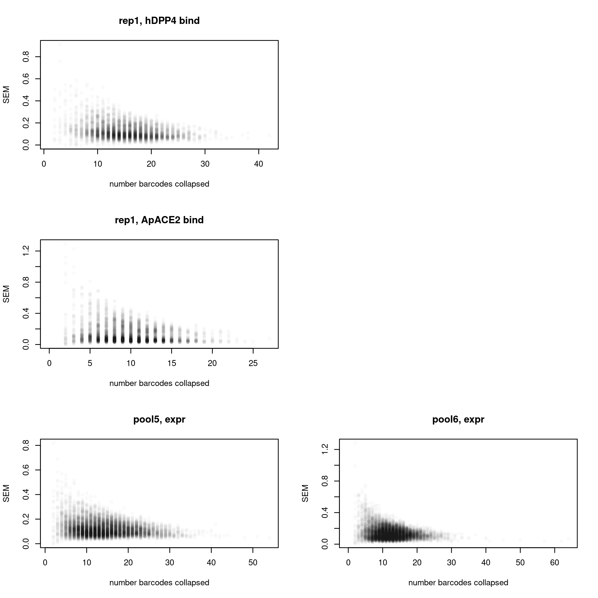
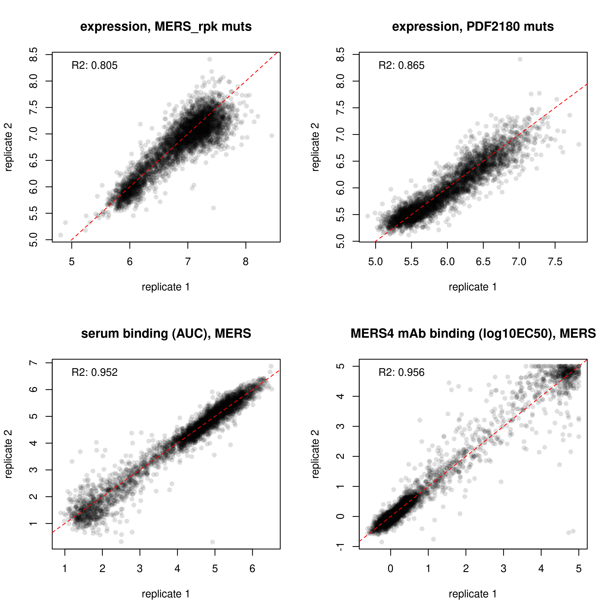

Collapse barcodes to final per-RBD/mutant phenotype scores
================
Tyler Starr
01/02/2023

- <a href="#setup" id="toc-setup">Setup</a>
- <a href="#calculate-per-variant-mean-scores-within-replicates"
  id="toc-calculate-per-variant-mean-scores-within-replicates">Calculate
  per-variant mean scores within replicates</a>
- <a href="#calculate-per-mutant-score-across-libraries"
  id="toc-calculate-per-mutant-score-across-libraries">Calculate
  per-mutant score across libraries</a>
- <a href="#heatmaps" id="toc-heatmaps">Heatmaps!</a>

This notebook reads in the per-barcode titration Kds and expression
measurements from the `compute_binding_Kd` and
`compute_expression_meanF` scripts. It synthesizes these two sets of
results and calculates the final ‘mean’ phenotypes for each variant, and
generates some coverage and QC analyses.

``` r
require("knitr")
knitr::opts_chunk$set(echo = T)
knitr::opts_chunk$set(dev.args = list(png = list(type = "cairo")))

#list of packages to install/load
packages = c("yaml","data.table","tidyverse","gridExtra","plotly","withr","htmlwidgets")
#install any packages not already installed
installed_packages <- packages %in% rownames(installed.packages())
if(any(installed_packages == F)){
  install.packages(packages[!installed_packages])
}
#load packages
invisible(lapply(packages, library, character.only=T))

#read in config file
config <- read_yaml("config.yaml")

#annotation on RBD sites
RBD_sites <- read.csv(file=config$RBD_sites,stringsAsFactors = F,header=T)

#make output directory
if(!file.exists(config$final_variant_scores_dir)){
  dir.create(file.path(config$final_variant_scores_dir))
}
```

Session info for reproducing environment:

``` r
sessionInfo()
```

    ## R version 3.6.2 (2019-12-12)
    ## Platform: x86_64-pc-linux-gnu (64-bit)
    ## Running under: Ubuntu 18.04.6 LTS
    ## 
    ## Matrix products: default
    ## BLAS/LAPACK: /app/software/OpenBLAS/0.3.7-GCC-8.3.0/lib/libopenblas_haswellp-r0.3.7.so
    ## 
    ## locale:
    ##  [1] LC_CTYPE=en_US.UTF-8       LC_NUMERIC=C              
    ##  [3] LC_TIME=en_US.UTF-8        LC_COLLATE=en_US.UTF-8    
    ##  [5] LC_MONETARY=en_US.UTF-8    LC_MESSAGES=en_US.UTF-8   
    ##  [7] LC_PAPER=en_US.UTF-8       LC_NAME=C                 
    ##  [9] LC_ADDRESS=C               LC_TELEPHONE=C            
    ## [11] LC_MEASUREMENT=en_US.UTF-8 LC_IDENTIFICATION=C       
    ## 
    ## attached base packages:
    ## [1] stats     graphics  grDevices utils     datasets  methods   base     
    ## 
    ## other attached packages:
    ##  [1] htmlwidgets_1.5.1 withr_2.1.2       plotly_4.9.1      gridExtra_2.3    
    ##  [5] forcats_0.4.0     stringr_1.4.0     dplyr_0.8.3       purrr_0.3.3      
    ##  [9] readr_1.3.1       tidyr_1.0.0       tibble_3.0.2      ggplot2_3.3.0    
    ## [13] tidyverse_1.3.0   data.table_1.12.8 yaml_2.2.0        knitr_1.26       
    ## 
    ## loaded via a namespace (and not attached):
    ##  [1] tidyselect_1.1.0  xfun_0.11         haven_2.2.0       colorspace_1.4-1 
    ##  [5] vctrs_0.3.1       generics_0.0.2    viridisLite_0.3.0 htmltools_0.4.0  
    ##  [9] rlang_0.4.7       pillar_1.4.5      glue_1.3.1        DBI_1.1.0        
    ## [13] dbplyr_1.4.2      modelr_0.1.5      readxl_1.3.1      lifecycle_0.2.0  
    ## [17] munsell_0.5.0     gtable_0.3.0      cellranger_1.1.0  rvest_0.3.5      
    ## [21] evaluate_0.14     fansi_0.4.0       broom_0.7.0       Rcpp_1.0.3       
    ## [25] scales_1.1.0      backports_1.1.5   jsonlite_1.6      fs_1.3.1         
    ## [29] hms_0.5.2         digest_0.6.23     stringi_1.4.3     grid_3.6.2       
    ## [33] cli_2.0.0         tools_3.6.2       magrittr_1.5      lazyeval_0.2.2   
    ## [37] crayon_1.3.4      pkgconfig_2.0.3   ellipsis_0.3.0    xml2_1.3.3       
    ## [41] reprex_0.3.0      lubridate_1.7.4   assertthat_0.2.1  rmarkdown_2.0    
    ## [45] httr_1.4.1        rstudioapi_0.10   R6_2.4.1          compiler_3.6.2

## Setup

Read in tables of per-barcode expression and binding Kd measurements and
combine.

``` r
dt_bind <- data.table(read.csv(config$Titeseq_Kds_file_hDPP4),stringsAsFactors=F)
dt_expr <- data.table(read.csv(config$expression_sortseq_file),stringsAsFactors=F)
```

## Calculate per-variant mean scores within replicates

Calculate the mean binding and expression score collapsed by genotype.
Also output the number of barcodes across which a variant score was
determined in each library.

``` r
dt_bind[is.na(log10Ka_hDPP4),TiteSeq_hDPP4_avgcount:=NA]
dt_bind[library=="lib51_53A",library:="lib51_53"]
dt_expr[is.na(expression),expr_count:=NA]

dt_bind[,mean_bind_hDPP4:=mean(log10Ka_hDPP4,na.rm=T),by=c("library","target","variant_class","aa_substitutions")]
dt_bind[,sd_bind_hDPP4:=sd(log10Ka_hDPP4,na.rm=T),by=c("library","target","variant_class","aa_substitutions")]
dt_bind[,n_bc_bind_hDPP4:=sum(!is.na(log10Ka_hDPP4)),by=c("library","target","variant_class","aa_substitutions")]
dt_bind[,avg_count_bind_hDPP4:=mean(TiteSeq_hDPP4_avgcount,na.rm=T),by=c("library","target","variant_class","aa_substitutions")]

dt_bind <- unique(dt_bind[,.(library,target,variant_class,aa_substitutions,n_aa_substitutions,mean_bind_hDPP4,sd_bind_hDPP4,n_bc_bind_hDPP4,avg_count_bind_hDPP4)])

dt_expr[,mean_expr:=mean(expression,na.rm=T),by=c("library","target","variant_class","aa_substitutions")]
dt_expr[,sd_expr:=sd(expression,na.rm=T),by=c("library","target","variant_class","aa_substitutions")]
dt_expr[,n_bc_expr:=sum(!is.na(expression)),by=c("library","target","variant_class","aa_substitutions")]
dt_expr[,avg_count_expr:=mean(expr_count,na.rm=T),by=c("library","target","variant_class","aa_substitutions")]

dt_expr <- unique(dt_expr[,.(library,target,variant_class,aa_substitutions,n_aa_substitutions,mean_expr,sd_expr,n_bc_expr,avg_count_expr)])
```

Some QC plots. First, look at distribution of number barcodes for
binding and expression measurements for single mutant detemrinations.
These are ‘left-justified’ histograms, so the leftmost bar represents
the number of genotypes for which no barcodes were collapsed to final
measurement in a pool.

``` r
par(mfrow=c(2,2))
hist(dt_bind[library=="lib51_53" & variant_class %in% c("1 nonsynonymous","deletion") & n_aa_substitutions==1,n_bc_bind_hDPP4],main="lib51_53, bind",right=F,breaks=max(dt_bind[library=="lib51_53" & variant_class %in% c("1 nonsynonymous","deletion") & n_aa_substitutions==1,n_bc_bind_hDPP4],na.rm=T),xlab="")
#hist(dt_bind[library=="lib52_54" & variant_class %in% c("1 nonsynonymous","deletion") & n_aa_substitutions==1,n_bc_bind_hDPP4],main="lib52_54, bind",right=F,breaks=max(dt_bind[library=="lib52_54" & variant_class %in% c("1 nonsynonymous","deletion") & n_aa_substitutions==1,n_bc_bind_hDPP4],na.rm=T),xlab="")
plot(0,type='n',axes=FALSE,ann=F)
hist(dt_expr[library=="lib51_53" & variant_class %in% c("1 nonsynonymous","deletion") & n_aa_substitutions==1,n_bc_expr],main="lib51_53, expr",right=F,breaks=max(dt_expr[library=="lib51_53" & variant_class %in% c("1 nonsynonymous","deletion") & n_aa_substitutions==1,n_bc_expr],na.rm=T),xlab="number barcodes collapsed")
hist(dt_expr[library=="lib52_54" & variant_class %in% c("1 nonsynonymous","deletion") & n_aa_substitutions==1,n_bc_expr],main="lib52_54, expr",right=F,breaks=max(dt_expr[library=="lib52_54" & variant_class %in% c("1 nonsynonymous","deletion") & n_aa_substitutions==1,n_bc_expr],na.rm=T),xlab="number barcodes collapsed")
```


``` r
invisible(dev.print(pdf, paste(config$final_variant_scores_dir,"/histogram_n_bc_per_geno_sep-libs.pdf",sep=""),useDingbats=F))
```

What about how SEM tracks with number of barcodes collapsed? This could
help for choosing a minimum number of barcodes to use.

``` r
par(mfrow=c(2,2))
plot(dt_bind[library=="lib51_53" & variant_class %in% c("1 nonsynonymous","deletion") & n_aa_substitutions==1,n_bc_bind_hDPP4],
     dt_bind[library=="lib51_53" & variant_class %in% c("1 nonsynonymous","deletion") & n_aa_substitutions==1,sd_bind_hDPP4/sqrt(n_bc_bind_hDPP4)],
     pch=16,col="#00000005",main="lib51_53, hDPP4 bind",ylab="SEM",xlab="number barcodes collapsed")
# plot(dt_bind[library=="lib52_54" & variant_class %in% c("1 nonsynonymous","deletion") & n_aa_substitutions==1,n_bc_bind],
#      dt_bind[library=="lib52_54" & variant_class %in% c("1 nonsynonymous","deletion") & n_aa_substitutions==1,sd_bind/sqrt(n_bc_bind)],
#      pch=16,col="#00000005",main="lib52_54, bind",ylab="SEM",xlab="number barcodes collapsed")
plot(0,type='n',axes=FALSE,ann=F)
plot(dt_expr[library=="lib51_53" & variant_class %in% c("1 nonsynonymous","deletion") & n_aa_substitutions==1,n_bc_expr],
     dt_expr[library=="lib51_53" & variant_class %in% c("1 nonsynonymous","deletion") & n_aa_substitutions==1,sd_expr/sqrt(n_bc_expr)],
     pch=16,col="#00000005",main="lib51_53, expr",ylab="SEM",xlab="number barcodes collapsed")
plot(dt_expr[library=="lib52_54" & variant_class %in% c("1 nonsynonymous","deletion") & n_aa_substitutions==1,n_bc_expr],
     dt_expr[library=="lib52_54" & variant_class %in% c("1 nonsynonymous","deletion") & n_aa_substitutions==1,sd_expr/sqrt(n_bc_expr)],
     pch=16,col="#00000005",main="lib52_54, expr",ylab="SEM",xlab="number barcodes collapsed")
```



``` r
invisible(dev.print(pdf, paste(config$final_variant_scores_dir,"/sem_v_n-bc.pdf",sep=""),useDingbats=F))
```

Format into a ‘mutation lookup table’, where we focus just on the single
mutants (and wildtype), breakup the string of mutations, and fill in the
table to also include any missing mutants.

``` r
dt_mutant_bind <- dt_bind[variant_class %in% c("1 nonsynonymous","deletion") & n_aa_substitutions==1,]

#split mutation string
#define function to apply
split_mut <- function(x){
  split <- strsplit(x,split="")[[1]]
  return(list(split[1],as.numeric(paste(split[2:(length(split)-1)],collapse="")),split[length(split)]))
}
dt_mutant_bind[,c("wildtype","position","mutant"):=split_mut(as.character(aa_substitutions)),by=aa_substitutions]

dt_mutant_bind <- dt_mutant_bind[,.(library,target,wildtype,position,mutant,mean_bind_hDPP4,sd_bind_hDPP4,n_bc_bind_hDPP4,avg_count_bind_hDPP4)]

aas <- c("A","C","D","E","F","G","H","I","K","L","M","N","P","Q","R","S","T","V","W","Y","-")
#fill out missing values in table with a hideous loop, so the table is complete for all mutaitons (including those that are missing). If you are somebody who is reading this code, I apologize.
# for(lib in c("lib51_53","lib52_54")){
for(lib in c("lib51_53")){
  for(bg in as.character(unique(dt_mutant_bind$target))){
    for(pos in 1:max(dt_mutant_bind$position)){
      for(aa in aas){
        if(!(aa %in% as.character(dt_mutant_bind[library==lib & target==bg & position==pos,mutant]))){
          dt_mutant_bind <- rbind(dt_mutant_bind,list(lib, bg, dt_mutant_bind[target==bg & position==pos,wildtype][1],pos,aa),fill=T) #note this will leave NA for wildtype if a position is completely missing in both libraries
        }
      }
    }
  }
}
setkey(dt_mutant_bind,library,target,position,mutant)

#fill in wildtype values -- should vectorize in data table but being so stupid so just going to write for loop
for(bg in c("MERS","PDF2180")){
  # for(lib in c("lib51_53","lib52_54")){
  for(lib in c("lib51_53")){
    dt_mutant_bind[library==lib & target==bg & wildtype==mutant, c("mean_bind_hDPP4","sd_bind_hDPP4","n_bc_bind_hDPP4","avg_count_bind_hDPP4"):=dt_bind[library==lib & target==bg & variant_class=="wildtype",.(mean_bind_hDPP4,sd_bind_hDPP4,n_bc_bind_hDPP4,avg_count_bind_hDPP4)]]
  }
}

#add delta bind measures
for(bg in c("MERS","PDF2180")){
  # for(lib in c("lib51_53","lib52_54")){
  for(lib in c("lib51_53")){  
    ref_bind <- dt_bind[library==lib & target==bg & variant_class=="wildtype",mean_bind_hDPP4]
    dt_mutant_bind[library==lib & target==bg,delta_bind_hDPP4 := mean_bind_hDPP4 - ref_bind]
  }
}

#repeat for expr
dt_mutant_expr <- dt_expr[variant_class %in% c("1 nonsynonymous","deletion") & n_aa_substitutions==1,]

#split mutation string
#define function to apply
split_mut <- function(x){
  split <- strsplit(x,split="")[[1]]
  return(list(split[1],as.numeric(paste(split[2:(length(split)-1)],collapse="")),split[length(split)]))
}
dt_mutant_expr[,c("wildtype","position","mutant"):=split_mut(as.character(aa_substitutions)),by=aa_substitutions]

dt_mutant_expr <- dt_mutant_expr[,.(library,target,wildtype,position,mutant,mean_expr,sd_expr,n_bc_expr,avg_count_expr)]

aas <- c("A","C","D","E","F","G","H","I","K","L","M","N","P","Q","R","S","T","V","W","Y","-")
#fill out missing values in table with a hideous loop, so the table is complete for all mutaitons (including those that are missing). If you are somebody who is reading this code, I apologize.
for(lib in c("lib51_53","lib52_54")){
  for(bg in as.character(unique(dt_mutant_expr$target))){
    for(pos in 1:max(dt_mutant_expr$position)){
      for(aa in aas){
        if(!(aa %in% as.character(dt_mutant_expr[library==lib & target==bg & position==pos,mutant]))){
          dt_mutant_expr <- rbind(dt_mutant_expr,list(lib, bg, dt_mutant_expr[target==bg & position==pos,wildtype][1],pos,aa),fill=T)  #note this will leave NA for wildtype if a position is completely missing in both libraries
        }
      }
    }
  }
}
setkey(dt_mutant_expr,library,target,position,mutant)

#fill in wildtype values -- should vectorize in data table but being so stupid so just going to write for loop
for(bg in c("MERS","PDF2180")){
  for(lib in c("lib51_53","lib52_54")){
    dt_mutant_expr[library==lib & target==bg & wildtype==mutant, c("mean_expr","sd_expr","n_bc_expr","avg_count_expr"):=dt_expr[library==lib & target==bg & variant_class=="wildtype",.(mean_expr,sd_expr,n_bc_expr,avg_count_expr)]]
  }
}

#add delta expr measures
for(bg in c("MERS","PDF2180")){
  for(lib in c("lib51_53","lib52_54")){
    ref_expr <- dt_expr[library==lib & target==bg & variant_class=="wildtype",mean_expr]
    dt_mutant_expr[library==lib & target==bg,delta_expr := mean_expr - ref_expr]
  }
}
```

We have duplicates for expr measurement. Let’s look at correlations!

``` r
par(mfrow=c(1,3))
x <- dt_mutant_expr[library=="lib51_53" & wildtype!=mutant,mean_expr]; y <- dt_mutant_expr[library=="lib52_54" & wildtype!=mutant,mean_expr]; plot(x,y,pch=16,col="#00000020",xlab="replicate 1",ylab="replicate 2",main="expression");model <- lm(y~x);abline(a=0,b=1,lty=2,col="red");legend("topleft",legend=paste("R2: ",round(summary(model)$r.squared,3),sep=""),bty="n")

x <- dt_mutant_expr[library=="lib51_53" & wildtype!=mutant & target=="MERS",mean_expr]; y <- dt_mutant_expr[library=="lib52_54" & wildtype!=mutant & target=="MERS",mean_expr]; plot(x,y,pch=16,col="#00000020",xlab="replicate 1",ylab="replicate 2",main="expression, MERS");model <- lm(y~x);abline(a=0,b=1,lty=2,col="red");legend("topleft",legend=paste("R2: ",round(summary(model)$r.squared,3),sep=""),bty="n")

x <- dt_mutant_expr[library=="lib51_53" & wildtype!=mutant & target=="PDF2180",mean_expr]; y <- dt_mutant_expr[library=="lib52_54" & wildtype!=mutant & target=="PDF2180",mean_expr]; plot(x,y,pch=16,col="#00000020",xlab="replicate 1",ylab="replicate 2",main="expression, PDF2180");model <- lm(y~x);abline(a=0,b=1,lty=2,col="red");legend("topleft",legend=paste("R2: ",round(summary(model)$r.squared,3),sep=""),bty="n")
```



``` r
# x <- dt_mutant_bind[library=="lib51_53" & wildtype!=mutant,mean_bind]; y <- dt_mutant_bind[library=="lib52_54" & wildtype!=mutant,mean_bind]; plot(x,y,pch=16,col="#00000020",xlab="replicate 1",ylab="replicate 2",main="binding affinity");model <- lm(y~x);abline(a=0,b=1,lty=2,col="red");legend("topleft",legend=paste("R2: ",round(summary(model)$r.squared,3),sep=""),bty="n")

invisible(dev.print(pdf, paste(config$final_variant_scores_dir,"/replicate_correlations.pdf",sep=""),useDingbats=F))
```

## Calculate per-mutant score across libraries

Collapse down to mean from both replicates, and total n barcodes between
the two/three replicates. Also record the number of the replicates the
variant was quantified within. Note, we are currently keeping a value
even if it’s determined from a single bc fit in a single pool. Later on,
we may want to require some combination of minimum number of bcs within
or between libraries for retention.

``` r
dt_final_bind <- copy(dt_mutant_bind)

dt_final_bind[ ,bind_hDPP4:=mean(mean_bind_hDPP4,na.rm=T),by=c("target","position","mutant")]
dt_final_bind[ ,delta_bind_hDPP4:=mean(delta_bind_hDPP4,na.rm=T),by=c("target","position","mutant")]
dt_final_bind[ ,n_bc_bind_hDPP4:=sum(n_bc_bind_hDPP4,na.rm=T),by=c("target","position","mutant")]
dt_final_bind[ ,n_libs_bind_hDPP4:=sum(!is.na(mean_bind_hDPP4)),by=c("target","position","mutant")]

dt_final_bind <- unique(dt_final_bind[,.(target,wildtype,position,mutant,bind_hDPP4,delta_bind_hDPP4,n_bc_bind_hDPP4,n_libs_bind_hDPP4)])

#repeat expr
dt_final_expr <- copy(dt_mutant_expr)

dt_final_expr[ ,expr_tot:=mean(mean_expr,na.rm=T),by=c("target","position","mutant")]
dt_final_expr[ ,delta_expr_tot:=mean(delta_expr,na.rm=T),by=c("target","position","mutant")]
dt_final_expr[ ,n_bc_expr_tot:=sum(n_bc_expr,na.rm=T),by=c("target","position","mutant")]
dt_final_expr[ ,n_libs_expr_tot:=sum(!is.na(mean_expr)),by=c("target","position","mutant")]

dt_final_expr <- unique(dt_final_expr[,.(target,wildtype,position,mutant,expr_tot,delta_expr_tot,n_bc_expr_tot,n_libs_expr_tot)])

#merge together
dt_final <- merge(dt_final_bind, dt_final_expr)
setkey(dt_final,target,position,mutant)

#add the rep1 and rep2 bind and expr averages
dt_final[,hDPP4_bind_rep1 := dt_mutant_bind[library=="lib51_53", mean_bind_hDPP4]]
dt_final[,hDPP4_bind_rep2 := dt_mutant_bind[library=="lib52_54", mean_bind_hDPP4]]
dt_final[,expr_rep1 := dt_mutant_expr[library=="lib51_53", mean_expr]]
dt_final[,expr_rep2 := dt_mutant_expr[library=="lib52_54", mean_expr]]

#reindex sites for each background according to alignment. I will keep two columns: one gives each mutation in the "MERS" spike indexing, one that gives that spike's indexing

#remove positions past the last index (no wildtype position). Could also fix this above when we fill out this table
dt_final <- dt_final[!is.na(wildtype)]
#set empty columns to fill with indexed sites
dt_final$site <- as.character(NA)
dt_final$site_MERS <- as.character(NA)
#do by bg with if/else looping
for(i in 1:nrow(dt_final)){
  if(dt_final[i,target]=="MERS"){
    dt_final[i,site := as.character(RBD_sites[RBD_sites$site_MERS_RBD==dt_final[i,position] & !is.na(RBD_sites$site_MERS_RBD),"site_MERS_spike"])]
    dt_final[i,site_MERS := as.character(RBD_sites[RBD_sites$site_MERS_RBD==dt_final[i,position] & !is.na(RBD_sites$site_MERS_RBD),"site_MERS_spike"])]
  }else if(dt_final[i,target]=="PDF2180"){
    dt_final[i,site := as.character(RBD_sites[RBD_sites$site_PDF.2180_RBD==dt_final[i,position] & !is.na(RBD_sites$site_PDF.2180_RBD),"site_PDF.2180_spike"])]
    dt_final[i,site_MERS := as.character(RBD_sites[RBD_sites$site_PDF.2180_RBD==dt_final[i,position] & !is.na(RBD_sites$site_PDF.2180_RBD),"site_MERS_spike"])]
  }
}

#add single mutation string
dt_final[,mutation:=paste(wildtype,site,mutant,sep=""),by=c("wildtype","site","mutant")]
dt_final[,mutation_MERS:=paste(wildtype,site_MERS,mutant,sep=""),by=c("wildtype","site_MERS","mutant")]

#rename some of the columns
setnames(dt_final,"expr_tot","expr")
setnames(dt_final,"delta_expr_tot","delta_expr")
setnames(dt_final,"n_bc_expr_tot","n_bc_expr")
setnames(dt_final,"n_libs_expr_tot","n_libs_expr")
setnames(dt_final,"position","RBD_index")
setnames(dt_final,"site","position")
setnames(dt_final,"site_MERS","position_MERS")
```

Relationship between mutaitonal effects on binding and expression. It
looks like in contrast to other cases, perhaps because of lower parental
expression, we are geting correlation also in the strong positive
mutational effects direction (i.e., strongly expreession-enhancing
mutations appear with higher Kd) which is problematic.

``` r
par(mfrow=c(1,3))
x <- dt_final[wildtype!=mutant,delta_expr]; y <- dt_final[wildtype!=mutant,delta_bind_hDPP4]; plot(x,y,pch=16,col="#00000020",xlab="mutant change in expression",ylab="mutant change in hDPP4 binding",main="pooled");model <- lm(y~x);abline(h=0,lty=2,col="gray30");abline(v=0,lty=2,col="gray30");legend("topleft",legend=paste("R2: ",round(summary(model)$r.squared,3),sep=""),bty="n")

x <- dt_final[target=="MERS" & wildtype!=mutant,delta_expr]; y <- dt_final[target=="MERS" & wildtype!=mutant,delta_bind_hDPP4]; plot(x,y,pch=16,col="#00000020",xlab="mutant change in expression",ylab="mutant change in hDPP4 binding",main="MERS");model <- lm(y~x);abline(h=0,lty=2,col="gray30");abline(v=0,lty=2,col="gray30");legend("topleft",legend=paste("R2: ",round(summary(model)$r.squared,3),sep=""),bty="n")

x <- dt_final[target=="PDF2180" & wildtype!=mutant,delta_expr]; y <- dt_final[target=="PDF2180" & wildtype!=mutant,delta_bind_hDPP4]; plot(x,y,pch=16,col="#00000020",xlab="mutant change in expression",ylab="mutant change in hDPP4 binding",main="PDF2180");model <- lm(y~x);abline(h=0,lty=2,col="gray30");abline(v=0,lty=2,col="gray30");legend("topleft",legend=paste("R2: ",round(summary(model)$r.squared,3),sep=""),bty="n")
```


``` r
# x <- dt_mutant_bind[library=="lib51_53" & wildtype!=mutant,mean_bind]; y <- dt_mutant_bind[library=="lib52_54" & wildtype!=mutant,mean_bind]; plot(x,y,pch=16,col="#00000020",xlab="replicate 1",ylab="replicate 2",main="binding affinity");model <- lm(y~x);abline(a=0,b=1,lty=2,col="red");legend("topleft",legend=paste("R2: ",round(summary(model)$r.squared,3),sep=""),bty="n")

invisible(dev.print(pdf, paste(config$final_variant_scores_dir,"/correlation_bind-v-expr.pdf",sep=""),useDingbats=F))
```

Interactive?

``` r
p1 <- ggplot(dt_final)+aes(delta_expr, delta_bind_hDPP4, label = mutation)+ #can do label = mutation_MERS to get the label in mers indexing
  geom_point(shape=16,alpha=0.5,size=1.5)+
  facet_wrap(~target,nrow=1)+
  theme_bw()+
  xlab('mutant change in expression')+
  ylab('mutant change in hDPP4 binding')

#ggplotly(p1) #if want to see it interactvie in rstudio

#to save widget as html
saveWidgetFix <- function (widget,file,...) {
  ## A wrapper to saveWidget which compensates for arguable BUG in
  ## saveWidget which requires `file` to be in current working
  ## directory.
  wd<-getwd()
  on.exit(setwd(wd))
  outDir<-dirname(file)
  file<-basename(file)
  setwd(outDir);
  saveWidget(widget,file=file,...)
}
p1.g <- ggplotly(p1)
saveWidgetFix(p1.g, file=paste(config$final_variant_scores_dir,"/correlation_bind-v-expr_interactive.html",sep=""))
```

Censor any measurements that are from \<3 bc or only sampled in a single
replicate? Don’t do this for now.

``` r
# min_bc <- 2
# min_lib <- 2
# 
# dt_final[n_bc_bind < min_bc & n_libs_bind < min_lib, c("bind","delta_bind","n_bc_bind","n_libs_bind") := list(NA,NA,NA,NA)]
# dt_final[n_bc_expr < min_bc & n_libs_expr < min_lib, c("expr","delta_expr","n_bc_expr","n_libs_expr") := list(NA,NA,NA,NA)]
```

Coverage stats on n_barcodes for different measurements in the final
pooled measurements

``` r
par(mfrow=c(2,2))
#MERS
hist(dt_final[wildtype!=mutant & target %in% c("MERS"), n_bc_bind_hDPP4],col="gray50",main=paste("mutant bind_hDPP4 score,\nmedian ",median(dt_final[wildtype!=mutant & target %in% c("MERS"), n_bc_bind_hDPP4],na.rm=T),sep=""),right=F,breaks=max(dt_final[wildtype!=mutant & target %in% c("MERS","PDF2180"), n_bc_bind_hDPP4])/2,xlab="number barcodes", xlim=c(0,100))
hist(dt_final[wildtype!=mutant & target %in% c("MERS"), n_bc_expr],col="gray50",main=paste("mutant expr score,\nmedian ",median(dt_final[wildtype!=mutant & target %in% c("MERS"), n_bc_expr],na.rm=T),sep=""),right=F,breaks=max(dt_final[wildtype!=mutant & target %in% c("MERS","PDF2180"), n_bc_expr])/2,xlab="", xlim=c(0,100))

#PDF2180
hist(dt_final[wildtype!=mutant & target %in% c("PDF2180"), n_bc_bind_hDPP4],col="gray50",main=paste("mutant bind_hDPP4 score,\nmedian ",median(dt_final[wildtype!=mutant & target %in% c("PDF2180"), n_bc_bind_hDPP4],na.rm=T),sep=""),right=F,breaks=max(dt_final[wildtype!=mutant & target %in% c("MERS","PDF2180"), n_bc_bind_hDPP4])/2,xlab="number barcodes", xlim=c(0,100))
hist(dt_final[wildtype!=mutant & target %in% c("PDF2180"), n_bc_expr],col="gray50",main=paste("mutant expr score,\nmedian ",median(dt_final[wildtype!=mutant & target %in% c("PDF2180"), n_bc_expr],na.rm=T),sep=""),right=F,breaks=max(dt_final[wildtype!=mutant & target %in% c("MERS","PDF2180"), n_bc_expr])/2,xlab="", xlim=c(0,100))
```


``` r
invisible(dev.print(pdf, paste(config$final_variant_scores_dir,"/histogram_n_bc_per_geno_pooled-libs.pdf",sep="")))
```

## Heatmaps!

Order factor variables for plotting

``` r
#order targets in plotting order
dt_final$target <- factor(dt_final$target,levels=c("MERS","PDF2180"))
#order mutant as a factor for grouping by rough biochemical grouping
dt_final$mutant <- factor(dt_final$mutant, levels=c("-","C","P","G","V","M","L","I","A","F","W","Y","T","S","N","Q","E","D","H","K","R"))
#add character vector indicating wildtype to use as plotting symbols for wt
dt_final[,wildtype_indicator := ""]
dt_final[as.character(mutant)==as.character(wildtype),wildtype_indicator := "x"]

##order the sites character vector
dt_final$position_MERS <-factor(dt_final$position_MERS,levels=sort(unique(dt_final$position_MERS)))
dt_final$position <-factor(dt_final$position,levels=sort(unique(dt_final$position)))

#make temp long-form data frame
temp <- data.table::melt(dt_final[, .(target,position,position_MERS,mutant,bind_hDPP4,delta_bind_hDPP4,expr,delta_expr,wildtype_indicator)],id.vars=c("target","position","position_MERS","mutant","wildtype_indicator"),measure.vars=c("bind_hDPP4","delta_bind_hDPP4","expr","delta_expr"),variable.name="measurement",value.name="value")

#for method to duplicate aa labels on right side of plot https://github.com/tidyverse/ggplot2/issues/3171
guide_axis_label_trans <- function(label_trans = identity, ...) {
  axis_guide <- guide_axis(...)
  axis_guide$label_trans <- rlang::as_function(label_trans)
  class(axis_guide) <- c("guide_axis_trans", class(axis_guide))
  axis_guide
}

guide_train.guide_axis_trans <- function(x, ...) {
  trained <- NextMethod()
  trained$key$.label <- x$label_trans(trained$key$.label)
  trained
}
```

Make heatmaps faceted by target, showing raw affinity and delta-affinity
of muts relative to respective

``` r
p1 <- ggplot(temp[measurement=="bind_hDPP4",],aes(position_MERS,mutant))+geom_tile(aes(fill=value),color="black",lwd=0.1)+
  scale_fill_gradientn(colours=c("#FFFFFF","#003366"),limits=c(5,11),na.value="yellow")+
  #scale_fill_gradientn(colours=c("#FFFFFF","#FFFFFF","#003366"),limits=c(5,12),values=c(0,1/7,7/7),na.value="yellow")+ #three notches in case I want to 'censor' closer to the 5 boundary condition
  #scale_x_continuous(expand=c(0,0),breaks=c(377,seq(380,591,by=5)))+
  labs(x="",y="")+theme_classic(base_size=9)+
  coord_equal()+theme(axis.text.x=element_text(angle=90,hjust=1,vjust=0.6,face="bold",size=10),axis.text.y=element_text(face="bold",size=10))+
  facet_wrap(~target,nrow=2)+
  guides(y.sec=guide_axis_label_trans())+
  geom_text(aes(label=wildtype_indicator),size=2,color="gray10")+
  theme(strip.text.x = element_text(size = 18))

p1
```


``` r
invisible(dev.print(pdf, paste(config$final_variant_scores_dir,"/heatmap_SSM_log10Ka_hDPP4-by-target.pdf",sep="")))
```

Second, illustrating delta_log10Ka grouped by SSM position.

``` r
p1 <- ggplot(temp[measurement=="delta_bind_hDPP4",],aes(position_MERS,mutant))+geom_tile(aes(fill=value),color="black",lwd=0.1)+
  scale_fill_gradientn(colours=c("#A94E35","#A94E35","#F48365","#FFFFFF","#7378B9","#383C6C"),limits=c(-4.5,2),values=c(0/6.5,1.5/6.5,3/6.5,4.5/6.5,5.5/6.5,6/6.5),na.value="yellow")+ #effectively -3 to +2 scale
  #scale_x_continuous(expand=c(0,0),breaks=c(377,seq(380,591,by=5)))+
  labs(x="",y="")+theme_classic(base_size=9)+
  coord_equal()+theme(axis.text.x=element_text(angle=90,hjust=1,vjust=0.6,face="bold",size=10),axis.text.y=element_text(face="bold",size=10))+
  facet_wrap(~target,nrow=5)+
  guides(y.sec=guide_axis_label_trans())+
  geom_text(aes(label=wildtype_indicator),size=2,color="gray10")+
  theme(strip.text.x = element_text(size = 18))

p1
```


``` r
invisible(dev.print(pdf, paste(config$final_variant_scores_dir,"/heatmap_SSM_delta-log10Ka_hDPP4-by-target.pdf",sep="")))
```

Make heatmaps faceted by target, showing raw expression and
delta-expression of muts relative to respective wildtype

``` r
p1 <- ggplot(temp[measurement=="expr",],aes(position_MERS,mutant))+geom_tile(aes(fill=value),color="black",lwd=0.1)+
  scale_fill_gradientn(colours=c("#FFFFFF","#003366"),limits=c(5.5,9),na.value="yellow")+
  #scale_fill_gradientn(colours=c("#FFFFFF","#FFFFFF","#003366"),limits=c(5,11.2),values=c(0,1/7,7/7),na.value="yellow")+ #three notches in case I want to 'censor' closer to the 5 boundary condition
  #scale_x_continuous(expand=c(0,0),breaks=c(377,seq(380,591,by=5)))+
  labs(x="",y="")+theme_classic(base_size=9)+
  coord_equal()+theme(axis.text.x=element_text(angle=90,hjust=1,vjust=0.6,face="bold",size=10),axis.text.y=element_text(face="bold",size=10))+
  facet_wrap(~target,nrow=5)+
  guides(y.sec=guide_axis_label_trans())+
  geom_text(aes(label=wildtype_indicator),size=2,color="gray10")+
  theme(strip.text.x = element_text(size = 18))

p1
```


``` r
invisible(dev.print(pdf, paste(config$final_variant_scores_dir,"/heatmap_SSM_expression-by-target.pdf",sep="")))
```

Second, illustrating delta_expression grouped by SSM position.

``` r
p1 <- ggplot(temp[measurement=="delta_expr",],aes(position_MERS,mutant))+geom_tile(aes(fill=value),color="black",lwd=0.1)+
  scale_fill_gradientn(colours=c("#A94E35","#F48365","#FFFFFF","#7378B9","#383C6C"),limits=c(-2,1.5),values=c(0/3.5,1/3.5,2/3.5,2.75/3.5,3.5/3.5),na.value="yellow")+ #effectively -2 to +2
  #scale_x_continuous(expand=c(0,0),breaks=c(377,seq(380,591,by=5)))+
  labs(x="",y="")+theme_classic(base_size=9)+
  coord_equal()+theme(axis.text.x=element_text(angle=90,hjust=1,vjust=0.6,face="bold",size=10),axis.text.y=element_text(face="bold",size=10))+
  facet_wrap(~target,nrow=5)+
  guides(y.sec=guide_axis_label_trans())+
  geom_text(aes(label=wildtype_indicator),size=2,color="gray10")+
  theme(strip.text.x = element_text(size = 18))

p1
```


``` r
invisible(dev.print(pdf, paste(config$final_variant_scores_dir,"/heatmap_SSM_delta-expression-by-target.pdf",sep="")))
```

Save output files.

``` r
dt_final[,.(target, wildtype, position, position_MERS, mutant, mutation, mutation_MERS,
            bind_hDPP4, delta_bind_hDPP4, n_bc_bind_hDPP4, n_libs_bind_hDPP4,hDPP4_bind_rep1,hDPP4_bind_rep2,
            expr,delta_expr,n_bc_expr,n_libs_expr,expr_rep1,expr_rep2)] %>%
  mutate_if(is.numeric, round, digits=5) %>%
  write.csv(file=config$final_variant_scores_mut_file, row.names=F,quote=F)
```
