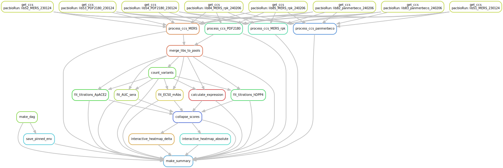

# Summary

Analysis run by [Snakefile](../../Snakefile)
using [this config file](../../config.yaml).
See the [README in the top directory](../../README.md)
for details.

Here is the DAG of the computational workflow:

Here is the Markdown output of each Jupyter notebook in the
workflow:

1. Process PacBio CCSs for each background: [MERS-CoV](process_ccs_MERS.md) and [PDF2180](process_ccs_PDF2180.md). Creates barcode-variant lookup tables for each background: [MERS-CoV](../variants/codon_variant_table_MERS.csv) and [PDF2180](../variants/codon_variant_table_PDF2180.csv).

2. Merge barcode-variant sublibraries into pooled libraries used for experiments, as done [here](merge_pools.md).

3. [Count variants by barcode](count_variants.md).
   Creates a [variant counts file](../counts/variant_counts.csv)
   giving counts of each barcoded variant in each condition.

4. Fit titration curves for RBD binding to [hDPP4](compute_Kd_hDPP4.md) to calculate per-barcode KD, recorded in these files for [hDPP4](../binding_Kd/bc_binding_hDPP4.csv).

5. [Analyze Sort-seq](compute_expression_meanF.md) to calculate per-barcode RBD expression, recorded in [this file](../expression_meanF/bc_expression.csv).

6. [Derive final genotype-level phenotypes from replicate barcoded sequences](collapse_scores.md).
   Generates final phenotypes, recorded in [this file](../final_variant_scores/final_variant_scores.csv).

7. Make interactive data visualizations, available [here](https://jbloomlab.github.io/MERS-PDF2180-RBD_DMS/)